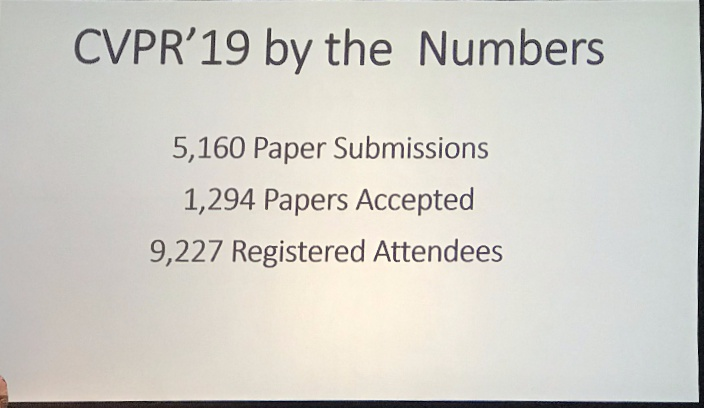
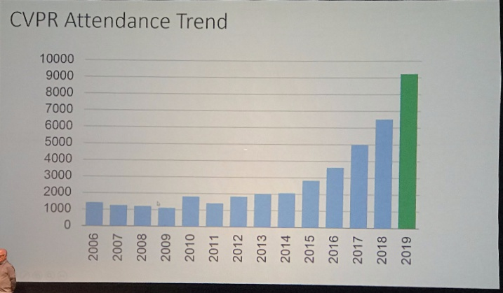
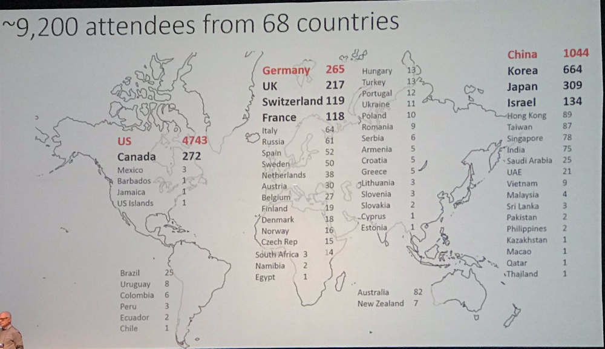
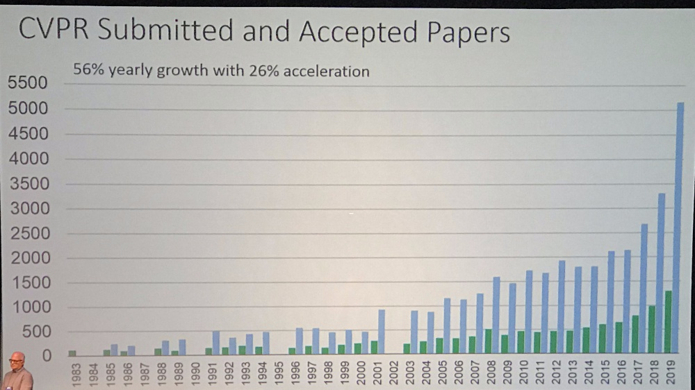
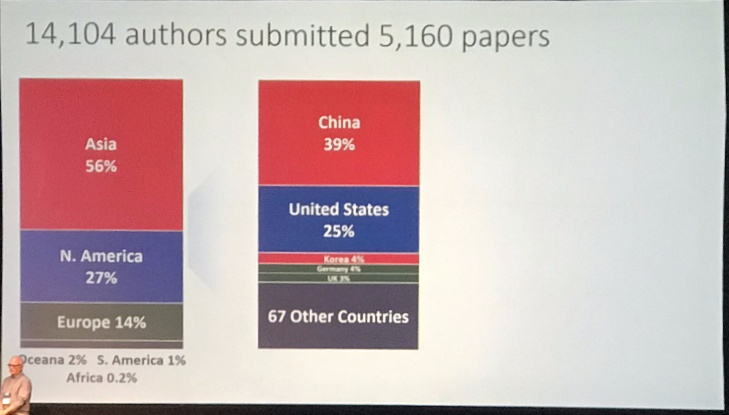
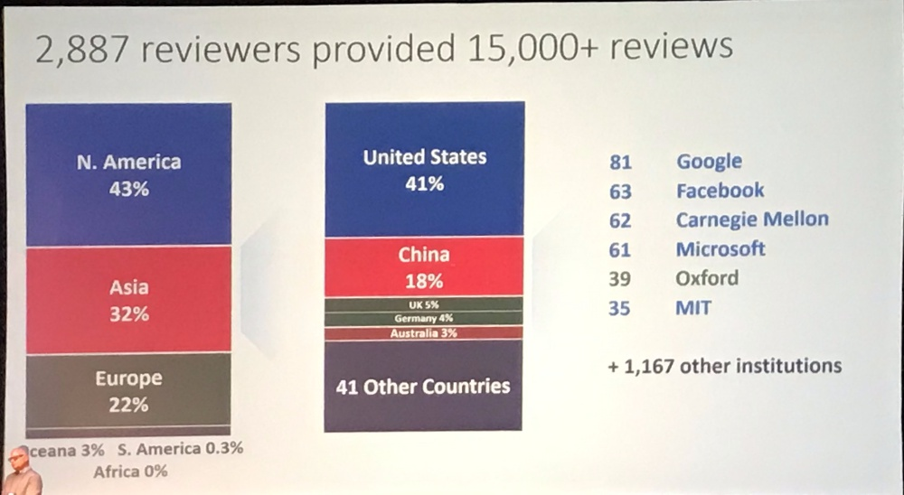
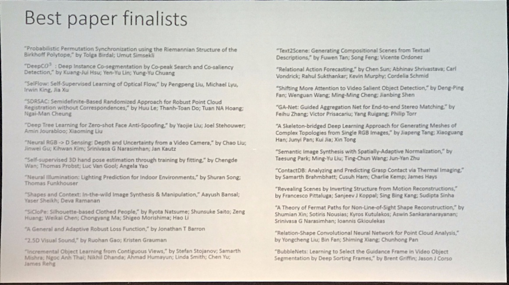
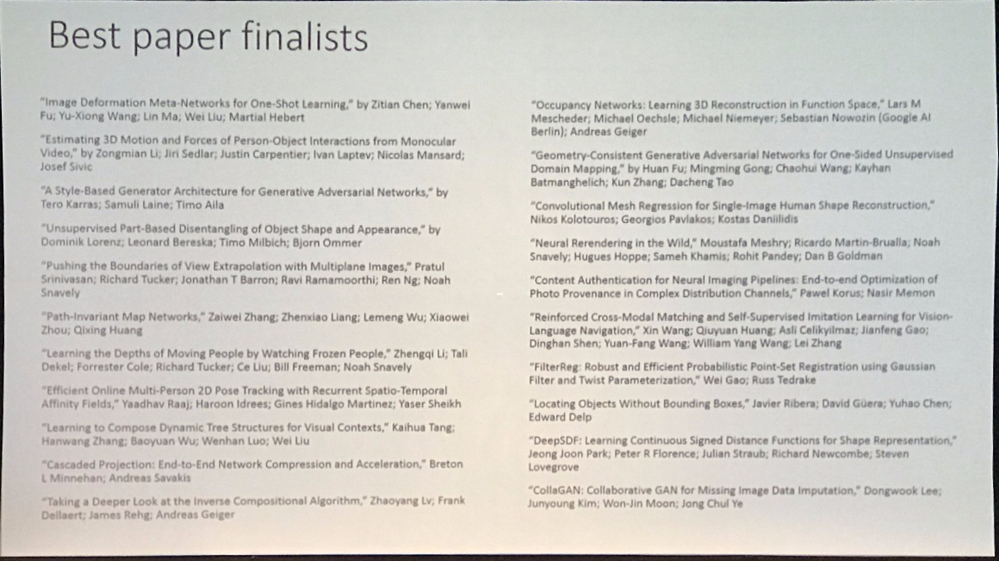

# 2019 CVPR

## [workshops](workshops.md)
- Highlight: Pseudo-Lidar and ++
- Highlight: Andrej's talk

## [posters](posters.md)
- See [posters.md](posters.md) for details

## [orals](orals.md)
- Highlight: [Large-Scale Long-Tailed Recognition in an Open World](https://arxiv.org/abs/1904.05160)

### Opening remarks

- Honorable mention: [A Style-Based Generator Architecture for Generative Adversarial Networks](https://arxiv.org/abs/1812.04948)
- Honorable Mention: [Learning the depth of moving people by watching frozen people]()
- Best student paper: [Reinforced Cross-Modal Matching and Self-Supervised Imitation Learning for Vision-Language Navigation](https://arxiv.org/abs/1811.10092)
- Best paper: [A Theory of Fermat Paths for Non-Line-of-Sight Shape Reconstruction](http://imaging.cs.cmu.edu/fermat_paths/assets/cvpr2019.pdf)
- Retrospective Most Impact Paper: ImageNet

