# Orals

Presentations that caught my eye in the 6 orals sessions from Tuesday to Thursday.

## 06/18/2019 (Tuesday)

#### Few shot learning
- Support set with few labeled sample per class, query set
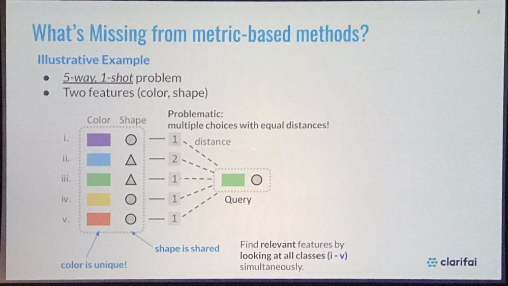

#### new CNN architecture
- Kerverlutional Neural Network
- Polynomial kernel, gaussian kernel
- Why does ReLU get high confidence (overconfident) far away from the training data
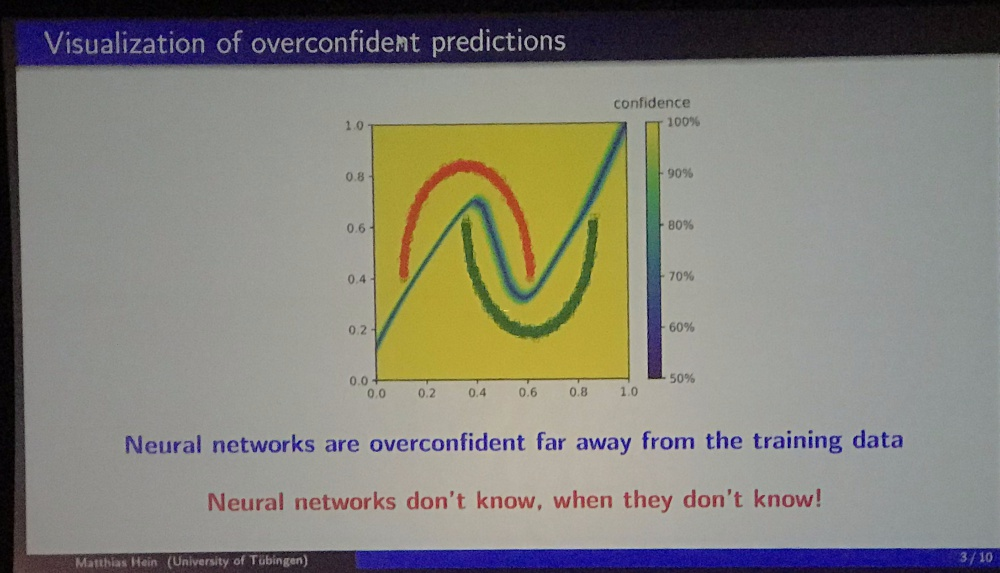
- Neural rejuvenation: force dead neuron to reinitialize
- deep metric learning: contrastive vs triplet learning
- Classification --> dense image prediction
- AUtO-DeepLab: similar to auto FPN
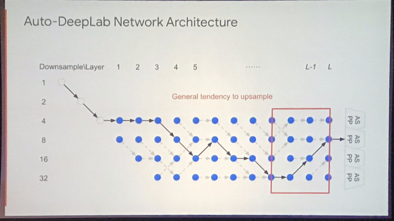
- Learning loss for active learning **Note**
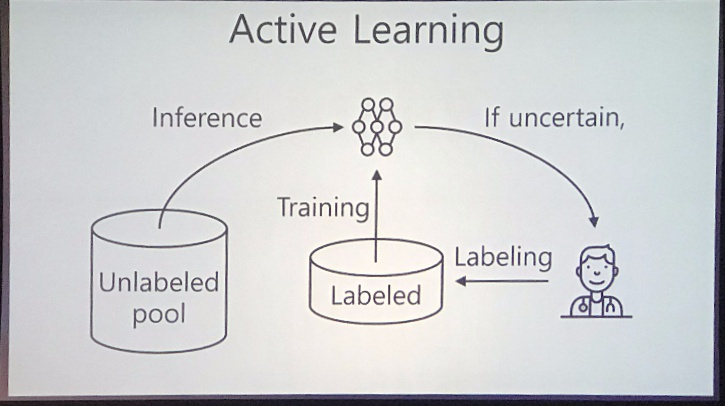
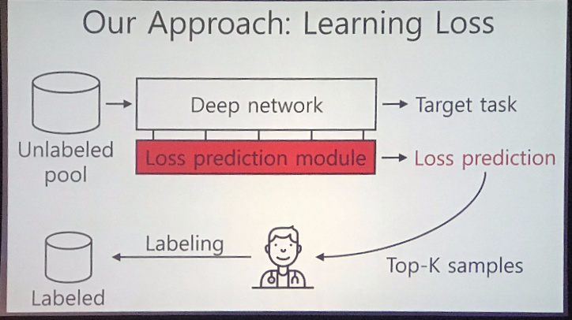
- [Striking the Right Balance with Uncertainty](https://arxiv.org/abs/1901.07590)

### Scenes and Representation
#### domain adaptation
- d-SNE: generalize model from source domain to target domain
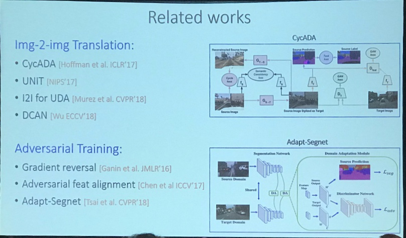
- ADVENT: Adversarial Entropy Minimization for Domain Adaptation in Semantic Segmentation
- **Note** Large-Scale Long-Tailed Recognition in an Open World 
	- [Dynamic Few-Shot Visual Learning without Forgetting](https://arxiv.org/abs/1804.09458) (CVPR2018)
	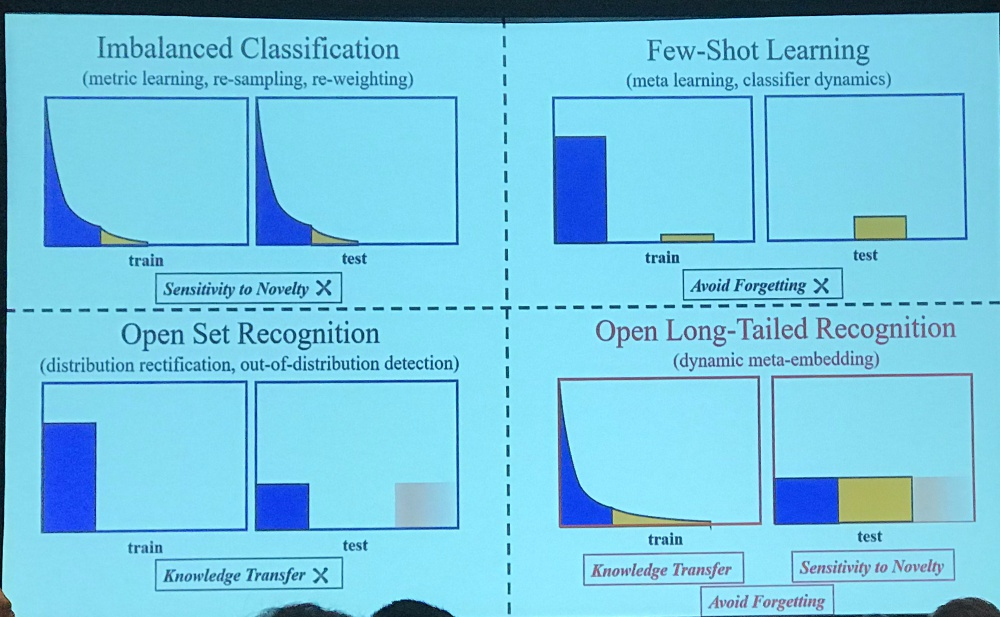
	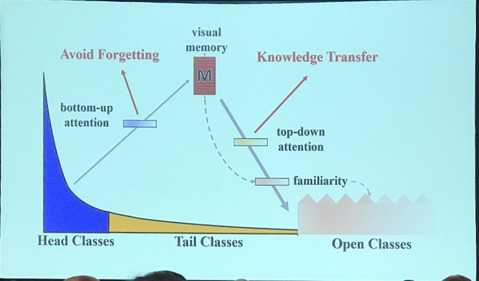
- Towards Scene Understanding: Unsupervised Monocular Depth Estimation With Semantic-Aware Representation:
	- train depth and semantic segmentation to help each other
	- train from different datasets
- Does CNN which perform well on ImageNet generalize well?
	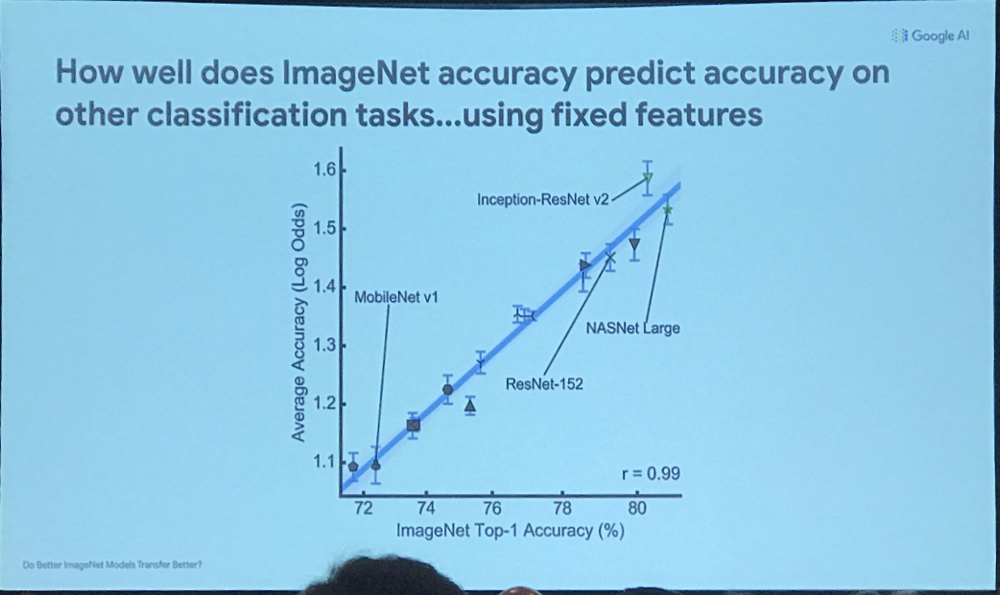
	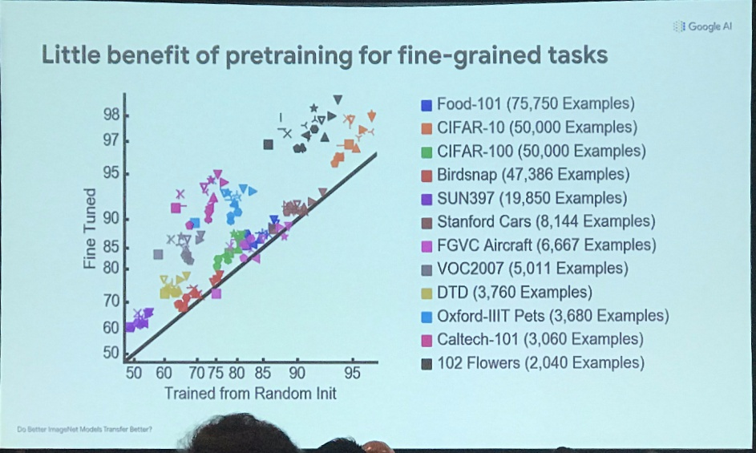
	
## 06/19/2019 (Wednesday)

### Motion and tracking
- Use siamese network for tracking
- **Note** [Deeper and Wider Siamese Networks for Real-Time Visual Tracking](https://arxiv.org/abs/1901.01660)
	- ResNet causes performance drop. Why?
	- SiamDW: redesign residual blocks for tracking
- Modeling games with GNN (with inherent insensitivity to permutation)
- Detection and pose tracking
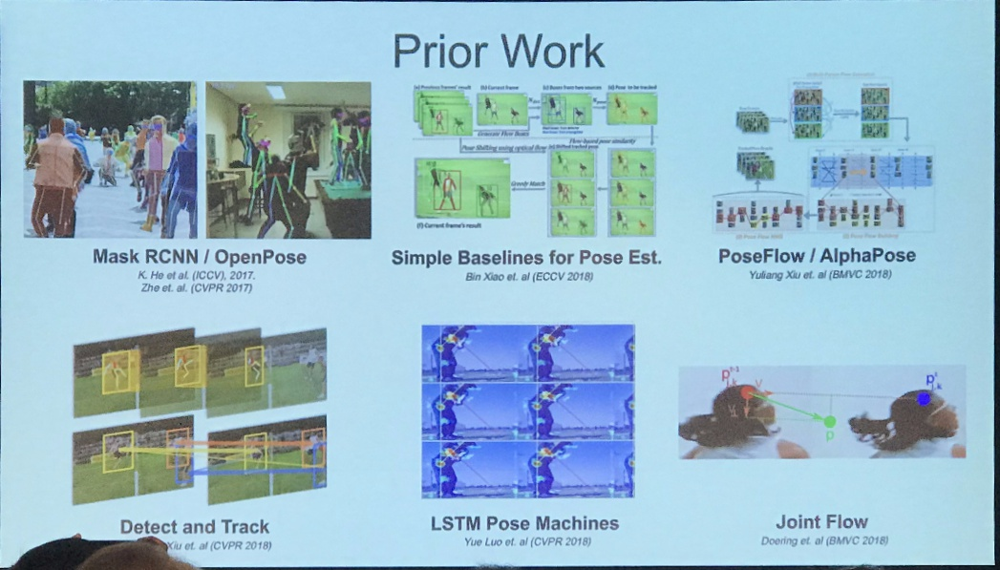
- [SiamFC: Fully-Convolutional Siamese Networks for Object Tracking](https://arxiv.org/abs/1606.09549) (ECCV 2016)
- [Graph Convolutional Tracking](http://nlpr-web.ia.ac.cn/mmc/homepage/jygao/gct_cvpr2019.html)

### Recognition
- **Notes** Mask Scoring R-CNN --> can be adapted to object detection
	- mask Iou is low, but mask score is high
	- regress iou head for predicting mask iou
	- this improves high quality segmenation
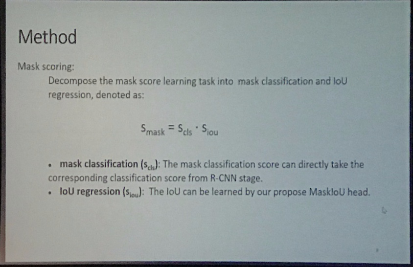
- Adaptive NMS: Refining Pedestrian Detection in a Crowd

- Locating Objects Without Bounding Boxes
- Few-shot learning with localization in realistic settings **Note**
	- three parameter free techniques
	- Batch folding **Note**
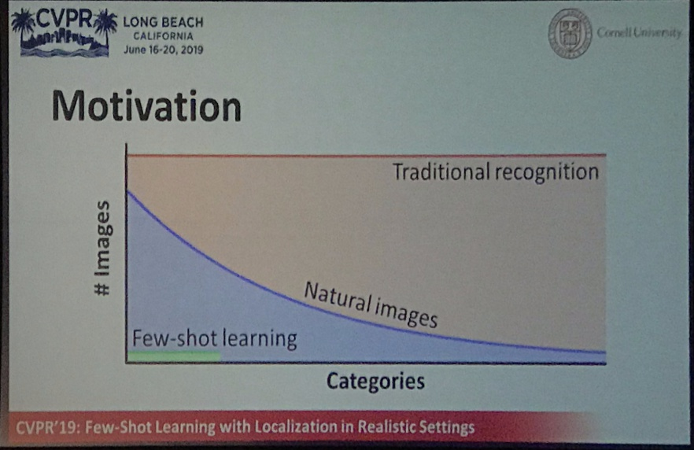

## 06/20/2019 (Thursday)

### Video Segmentation **Note**
- [Improving Semantic Segmentation via Video Propagation and Label Relaxation]()
	- relax boundary in the gt label
- [Accel: A Corrective Fusion Network for Efficient Semantic Segmentation on Video]()
	- 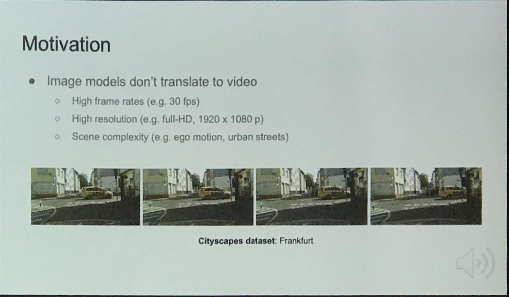
	- 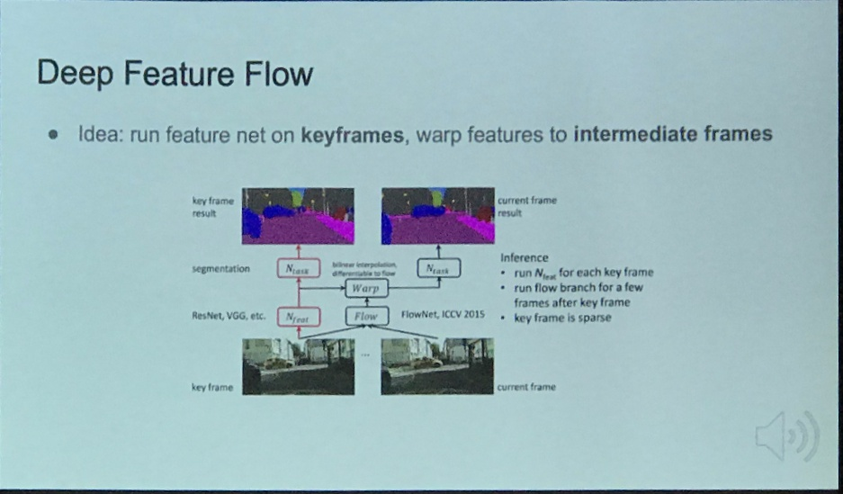
	- 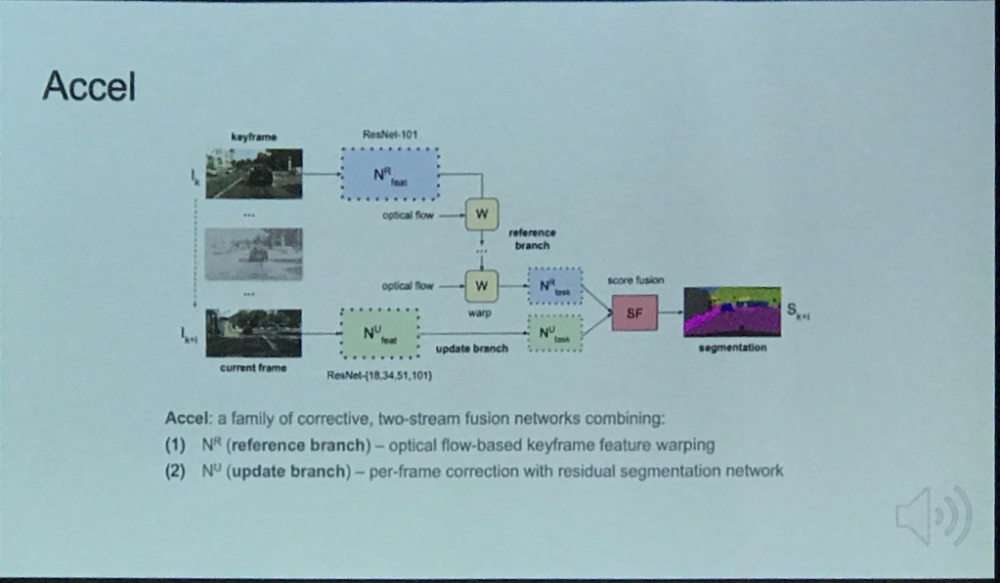
	- Deep feature flow from MSRA
- [Relation-Shape Convolutional Neural Network for Point Cloud Analysis]()
	- Seems like pointnet?
- [BubbleNets: Learning to Select the Guidance Frame in Video Object Segmentation by Deep Sorting Frames]()
	- This is similar to an actor-critic model?
	- DAVIS2017 (first frame annotaiton)
- [Collaborative Global-Local Networks for Memory-Efficient Segmentation of Ultra-High Resolution Images]()
	- can it be used for accelerating existing methods?
- Efficient Parameter-Free Clustering Using First Neighbor Relations **Note**
- A Generative Appearance Model for End-To-End Video Object Segmentation

### Deep learning
- ABN (attention branch network)

### Notes
- Main contribution template:
	- Proposed the problem
	- Created a method to address the problem
	- Contributed frist benchmark 
- Video segmentation
	- full segmentation on key frames and label propagation for frames in-between
- FBNet: Hardware-Aware Efficient ConvNet Design via Differentiable Neural Architecture Search
	- latency LUT works really great!

