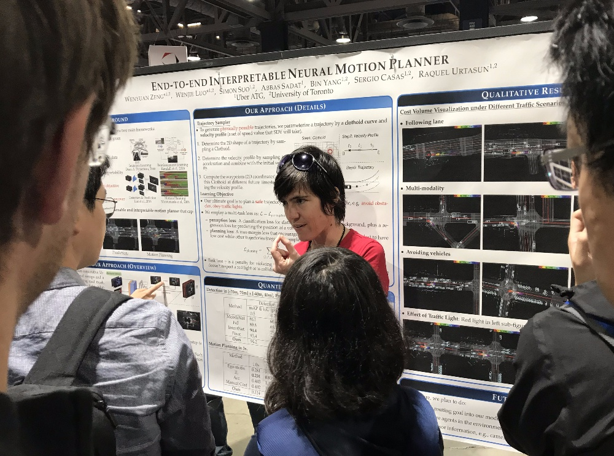

# Posters
Posters that caught my eyes in the 6 Poster sessions from Tuesday to Thursday.

### Theory
- [Grid R-CNN](https://arxiv.org/abs/1811.12030) (SenseTime) **Note**
- [Class-Balanced Loss Based on Effective Number of Samples](https://arxiv.org/abs/1901.05555)
- [Variational Autoencoders Pursue PCA Directions (by Accident)](https://arxiv.org/abs/1812.06775)
- [Pixel-Adaptive Convolutional Neural Networks](https://arxiv.org/abs/1904.05373)
- [Explainability Methods for Graph Convolutional Neural Networks](http://openaccess.thecvf.com/content_CVPR_2019/papers/Pope_Explainability_Methods_for_Graph_Convolutional_Neural_Networks_CVPR_2019_paper.pdf)
- [Building Detail-Sensitive Semantic Segmentation Networks
with Polynomial Pooling](http://openaccess.thecvf.com/content_CVPR_2019/papers/Wei_Building_Detail-Sensitive_Semantic_Segmentation_Networks_With_Polynomial_Pooling_CVPR_2019_paper.pdf)
- [SparseFool: a few pixels make a big difference](https://arxiv.org/abs/1811.02248)
- [Learning Multi-Class Segmentations From Single-Class Datasets](http://openaccess.thecvf.com/content_CVPR_2019/papers/Dmitriev_Learning_Multi-Class_Segmentations_From_Single-Class_Datasets_CVPR_2019_paper.pdf)
- [Effective Aesthetics Prediction with Multi-level Spatially Pooled Features](http://openaccess.thecvf.com/content_CVPR_2019/papers/Hosu_Effective_Aesthetics_Prediction_With_Multi-Level_Spatially_Pooled_Features_CVPR_2019_paper.pdf)
- [Learning Not to Learn: Training Deep Neural Networks with Biased Data](https://arxiv.org/abs/1812.10352)
- [Joint Manifold Diffusion for Combining Predictions on Decoupled Observations](https://arxiv.org/abs/1904.05159)
- [Kernel Transformer Networks for Compact Spherical Convolution](https://arxiv.org/abs/1812.03115) (check out the non-euclidean bbox!)

### depth estimation
- [Neural RGB->D Sensing: Depth and Uncertainty from a Video Camera](https://arxiv.org/abs/1901.02571)
- [Monocular 3D Object Detection Leveraging Accurate Proposals and Shape Reconstruction](https://arxiv.org/abs/1904.01690)
- [CAM-Convs: Camera-Aware Multi-Scale Convolutions for Single-View Depth](https://arxiv.org/abs/1904.02028)

### Model compression
- [ChamNet: Towards Efficient Network Design through Platform-Aware Model Adaptation](https://arxiv.org/abs/1812.08934)
- [Accelerating Convolutional Neural Networks via Activation Map Compression](https://arxiv.org/abs/1812.04056)
- [Structured Pruning of Neural Networks with Budget-Aware Regularization](https://arxiv.org/abs/1811.09332)
- [Partial Order Pruning: for Best Speed/Accuracy Trade-off in Neural Architecture Search](https://arxiv.org/abs/1903.03777) (check out the very accurate latency LUT!)
- [ESPNetv2: A Light-weight, Power Efficient, and General Purpose Convolutional Neural Network](https://github.com/sacmehta/ESPNetv2)

### Autonomous driving
- [End-to-end Interpretable Neural Motion Planner](http://www.cs.toronto.edu/~byang/papers/nmp.pdf)
- [Selective Sensor Fusion for Neural Visual-Inertial Odometry](https://arxiv.org/abs/1903.01534) (Oxford)
- [A Parametric Top-View Representation of Complex Road Scenes](https://arxiv.org/abs/1812.06152)
- [Monocular Depth Estimation Using Relative Depth Maps](http://openaccess.thecvf.com/content_CVPR_2019/papers/Lee_Monocular_Depth_Estimation_Using_Relative_Depth_Maps_CVPR_2019_paper.pdf) (indoor scenes)
- [PointNetLK: Robust & Efficient Point Cloud Registration using PointNet](https://arxiv.org/abs/1903.05711)
- [Adaptive NMS: Refining Pedestrian Detection in a Crowd](https://arxiv.org/abs/1904.03629)
- [http://cvlab.cse.msu.edu/pdfs/Brazil_Liu_CVPR2019.pdf](http://cvlab.cse.msu.edu/pdfs/Brazil_Liu_CVPR2019.pdf)
- [Deep Incremental Hashing Network for Efficient Image Retrieval](http://openaccess.thecvf.com/content_CVPR_2019/papers/Wu_Deep_Incremental_Hashing_Network_for_Efficient_Image_Retrieval_CVPR_2019_paper.pdf)
- [Learning for Single-Shot Confidence Calibration in Deep Neural Networks through Stochastic Inferences](https://arxiv.org/abs/1809.10877)
- [Rules of the Road: Predicting Driving Behavior with a Convolutional Model of Semantic Interactions](http://openaccess.thecvf.com/content_CVPR_2019/papers/Hong_Rules_of_the_Road_Predicting_Driving_Behavior_With_a_Convolutional_CVPR_2019_paper.pdf)
- [Siamese Cascaded Region Proposal Networks for Real-Time Visual Tracking](https://arxiv.org/abs/1812.06148)
- [Triangulation Learning Network: from Monocular to Stereo 3D Object Detection](https://arxiv.org/abs/1906.01193)
- [Leveraging Crowdsourced GPS Data for Road Extraction from Aerial Imagery](https://arxiv.org/abs/1905.01447)
- [Multi-Task Multi-Sensor Fusion for 3D Object Detection](http://www.cs.toronto.edu/~byang/papers/mmf.pdf)
- [Rare Event Detection using Disentangled Representation Learning](https://arxiv.org/abs/1812.01285)

### video detection/segmentation
- [FEELVOS: Fast End-to-End Embedding Learning for Video Object Segmentation](https://arxiv.org/abs/1902.09513)
- [DFANet: Deep Feature Aggregation for Real-Time Semantic Segmentation](https://arxiv.org/abs/1904.02216)

### TODO
## posters
- noise aware unsupervised deep lidar stereo fusion
- an attention based recurrent neural network for vehicle tailgate recognition
- superdepth: monocular 
- ROI-10D: Monocular Lifting of 2d detection to 6d pose and metric shape
- TASCNet Learning to fuse things and stuff
- PackNet SfM
- SPIGAN previleged adversarial learning from simulation

### Tuesday and Wednesday morning poster to be skimmed