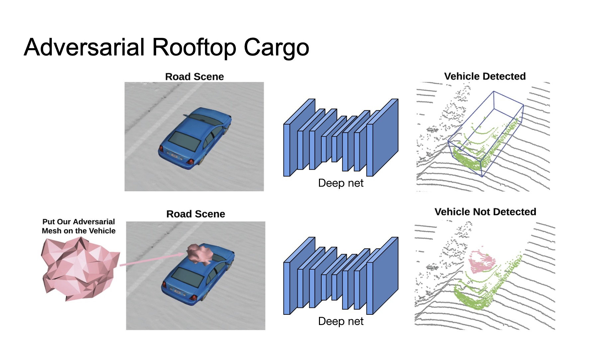
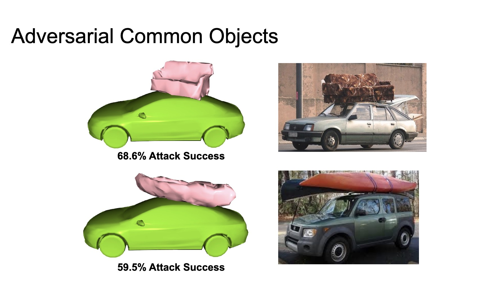
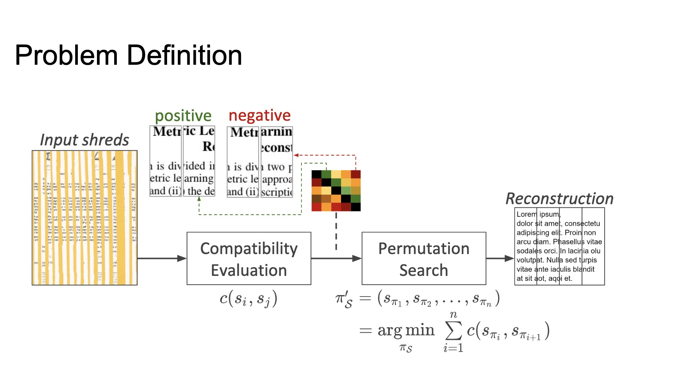

# Orals

## ORAL 2.1A: 3D FROM MULTIVIEW AND SENSORS (3)
- [SuperGlue: Learning Feature Matching With Graph Neural Networks](http://cvpr20.com/event/superglue-learning-feature-matching-with-graph-neural-networks-2/)
- [Reinforced Feature Points: Optimizing Feature Detection and Description for a High-Level Task](http://cvpr20.com/event/reinforced-feature-points-optimizing-feature-detection-and-description-for-a-high-level-task/)

## Oral 2.2A: Face, Gesture, and Body Pose (2)
- [Cascaded Deep Monocular 3D Human Pose Estimation With Evolutionary Training Data]()
- [Self-Supervised Deep Visual Odometry With Online Adaptation]() [Generalizes to unseen data]

## Oral 2.2C: Representation Learning
- [Circle Loss: A Unified Perspective of Pair Similarity Optimization](http://openaccess.thecvf.com/content_CVPR_2020/html/Sun_Circle_Loss_A_Unified_Perspective_of_Pair_Similarity_Optimization_CVPR_2020_paper.html)

## Oral 2.2B: Motion and Tracking (1)
- [GNN3DMOT: Graph Neural Network for 3D Multi-Object Tracking With 2D-3D Multi-Feature Learning](http://openaccess.thecvf.com/content_CVPR_2020/html/Weng_GNN3DMOT_Graph_Neural_Network_for_3D_Multi-Object_Tracking_With_2D-3D_CVPR_2020_paper.html)

## Poster session
- [HigherHRNet: Scale-Aware Representation Learning for Bottom-Up Human Pose Estimation]()
- [A Multi-Task Mean Teacher for Semi-Supervised Shadow Detection]() [Shadow segmentation]
- [The Devil Is in the Details: Delving Into Unbiased Data Processing for Human Pose Estimation]() [data processing miss by 1?]
- [Siamese Box Adaptive Network for Visual Tracking]()
- [How to Train Your Deep Multi-Object Tracker]()
- [End-to-End Camera Calibration for Broadcast Videos]
	- calibration for sports, to find basketball and football courts
- [Physically Realizable Adversarial Examples for LiDAR Object Detection]()
	- Uber ATG
	- Placing an object on top of vehicle roof leads to misdetection
	- Adversarial objects on rooftop are not uncommon for lidar object detection.
	
	
- [Cylindrical Convolutional Networks for Joint Object Detection and Viewpoint Estimation]	()
- [Fast(er) Reconstruction of Shredded Text Documents via Self-Supervised Deep Asymmetric Metric Learning]()
	- reconstruction of shredded documents
	
- [Learning to Evaluate Perception Models Using Planner-Centric Metrics]()
	- Not all cars are equally important
	- Generate planning based on perception results and evaluate trajectory from GT. 
- [DeFeat-Net: General Monocular Depth via Simultaneous Unsupervised Representation Learning]()
	- more robust depth estimation under diff lighting conditions
- [SpeedNet: Learning the Speediness in Videos]()
	- Only classify normal speed or speed up
	- adaptive speedup of video: looks more natural, less jittering
	- self-supervised learning for video understanding
	- video retrival: similar motion pattern
	- spatial temporal visualization
	- This seems to be quite similar to [Video Playback Rate Perception for Self-Supervised Spatio-Temporal Representation Learning]()
- [Learning to Measure the Static Friction Coefficient in Cloth Contact]()
	- Predicting friction parameter of fabrics with video
	- simulator to generate synthetic datasets
	- conv + LSTM + fc
- [15 Keypoints Is All You Need]()
	- We track human poses with transformers that are input keypoint sequences. This achieves SOTA accuracy while using 500x fewer FLOPS than optical flow.
- [Joint Spatial-Temporal Optimization for Stereo 3D Object Tracking]():
	- deep learning + temporal consistency for optimization 
- [Warping Residual Based Image Stitching for Large Parallax](https://openaccess.thecvf.com/content_CVPR_2020/papers/Lee_Warping_Residual_Based_Image_Stitching_for_Large_Parallax_CVPR_2020_paper.pdf)
	- Parallax robust image stithing
	- [Review of image stiching on Zhihu](https://www.zhihu.com/question/34535199)