# CVPR2019 Post AC Meeting Workshop
02/25/2019 At UCSD

20 top researchers in AI/CV field gave talk about their recent work. 
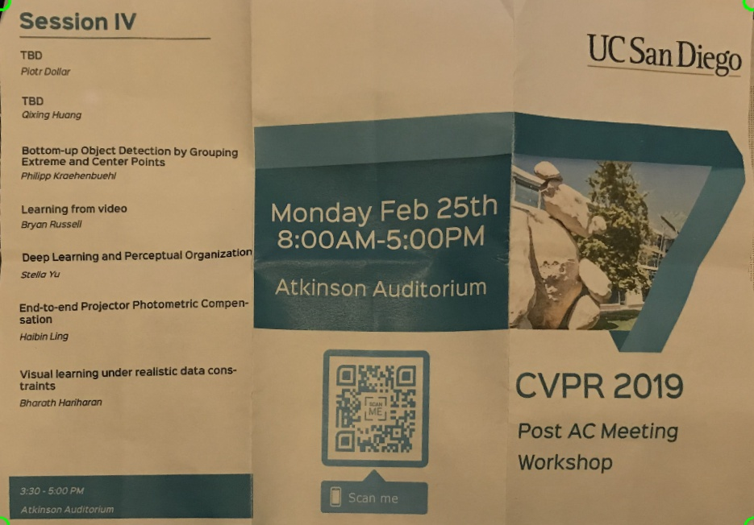
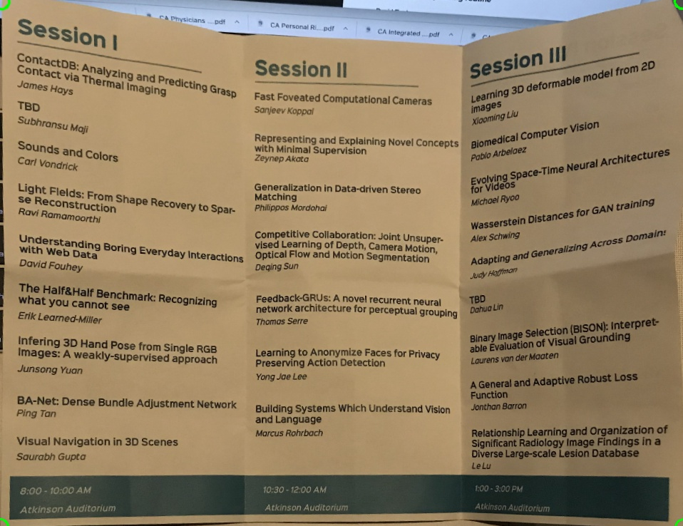

#### Contact DB with thermal imagery
- Estimating touch from thermal after-image taken by camera, understand 
- RGB, Depth, thermal image
- 3D printing material (and hand warmer) critical for retaining thermal signature
- Useful for robotics
- Pressure may be captured by amount of heat

#### Bayesian Perspective on deep image prior
- Task2Vec
- Task embedding for meta-learning
- ImageNet pretrained model may be suboptimal, but pretty good
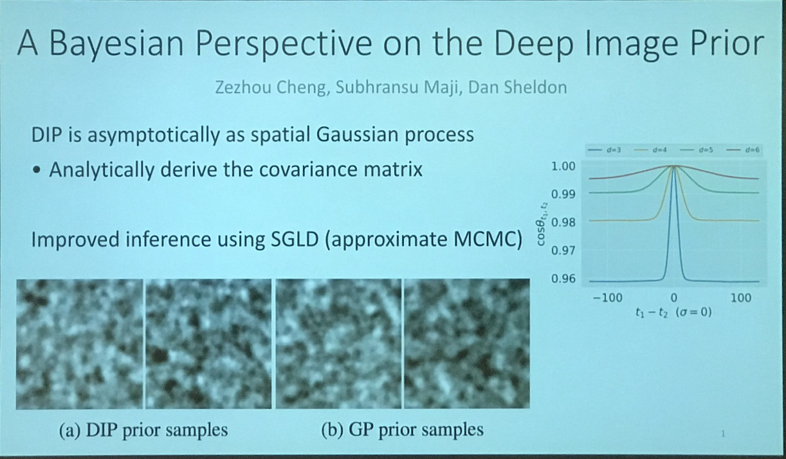

#### Colors and motions
- Carl Vondrick, Columbia University
- Consistency of color in most videos, exploit continuity
- Where to copy colors from one frame to the next
- This is robust to occlusion and can be useful for tracking
	- Instead of tracking objects, propagate color mask through frames.
	- This is still subpar compared with fully unsupervised model
- Color a black and white video with a reference color frame

#### BA-Net
- Ping Tan from sfu.ca

- Demon: depth and motion network for learning momnocular stereo
- Bundle Adjustment (BA): data association problem
- Finding correspondence between frames
- Notes: define the acronyms! don't assume your audience to know the acronyms. 

#### Understanding daily boring routine
- David Fouhey
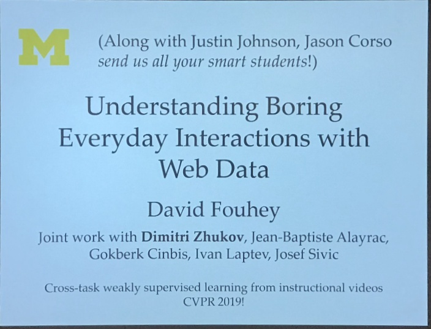
- Use Instructional video for video
	- Use speech2text as supervision
- Long tails --> share concepts between tasks (the world is combinatorial)
- Weakly supervised action recognition / zero shot learning
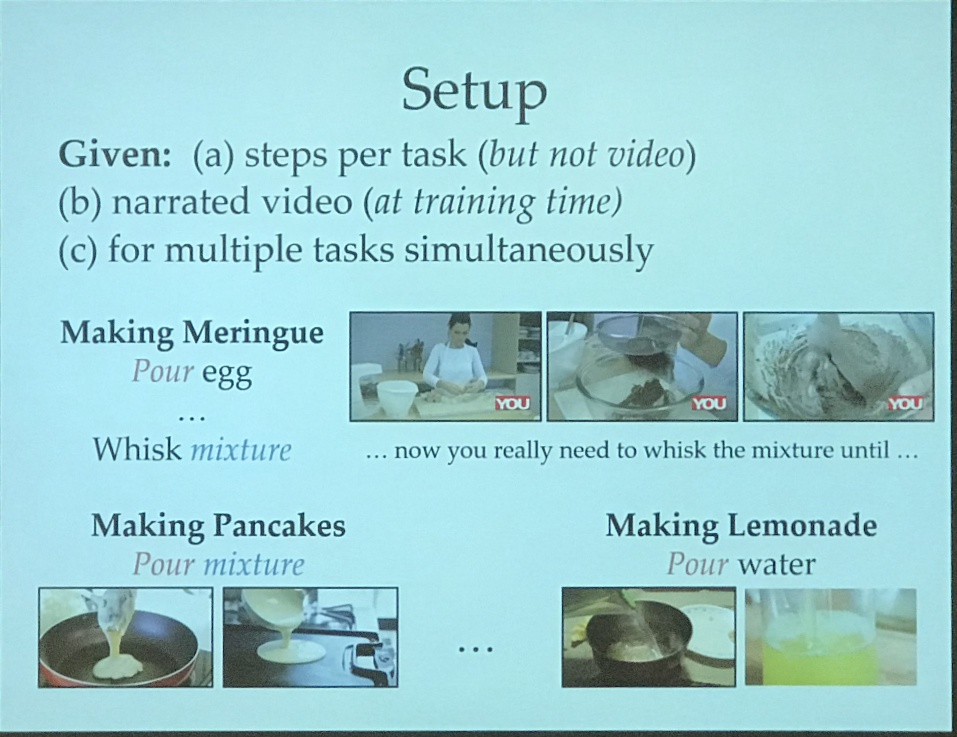
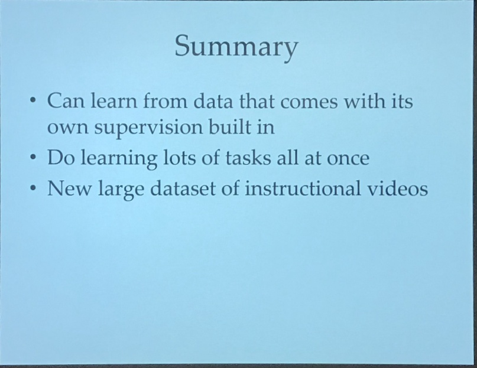

#### Half-and-Half image-to-label
- Erick Learned-Miller from Amherst

- Automatic adaptation of object detectors to novel domains by self-training
- by exploiting continuity methods (this should be critical to general intelligence that can understand common sense)
- develop methods for intelligence search --> leverage the "trail of breadcrumbs", prediction of what we cannot see
- Half&Half by blocking half of the image and predicting what is more likely to be found in the other half
- Note: Good researchers solve problems. Great researchers define problems.
- Anti-symmetric vs symmetric classifier during training, but deploy in anti-symmetric context.
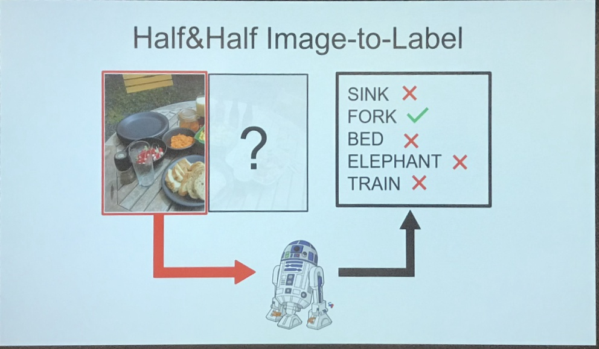

#### Infer 3D hand pose from RGB images
- Junsong Yuan, Univ of Buffalo
- Synthetic hand dataset, but mix synthetic and real data
- Predict hand gesture keypoints and mesh
- Use **Stacked Hourglass Network** for pose

#### Light Fields: from shape recovery to sparse reconstruction
- Ravi Ramamoorthi from UCSD
- Light fields camera: Lytro Illum
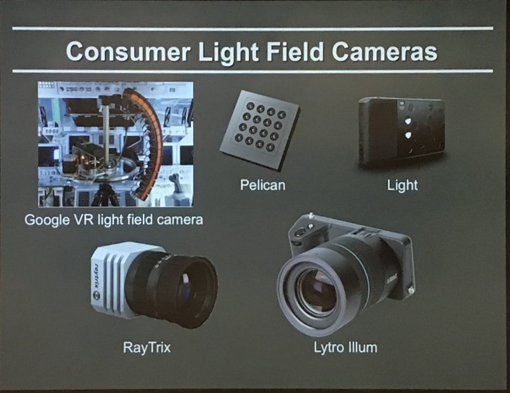
- generate high quality depth map from light-field image
- Tradeoff of light field camera: angular vs spatial resolution
- Reconstruct a light field image from single RGB image

#### Visual navigation in 3D scenes
- Saurabh Gupta
- Follow path under environment change and noise in motion
- Classical SLAM: get map first, then path planning
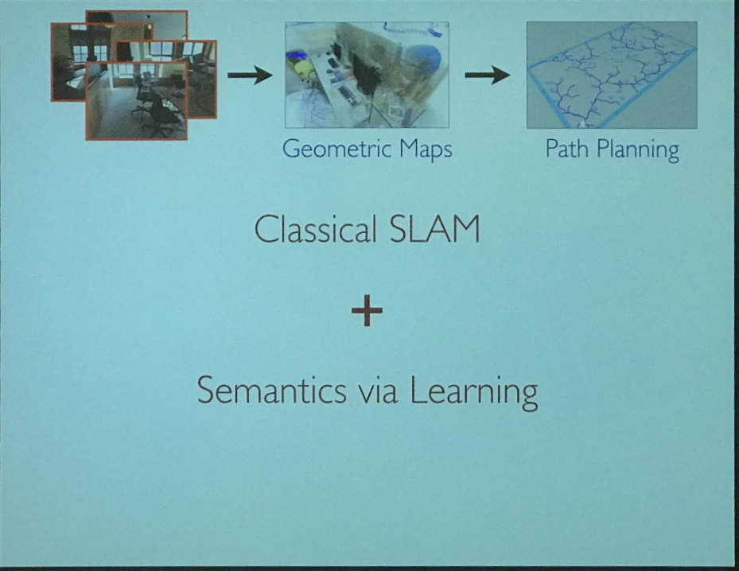
- CVPR 2017,  cognitive mapping and planning for visual navigation
- Operationalize insights from camera view
- Differential mapper: decoder-encoder to predict top-down view from camera view
- Note: add "lower is better" or "higher is better" is a great tip for creating figures

#### Fast foveating camera
- Sanjeev Koppal
- Equiangular scan by conventional lidar
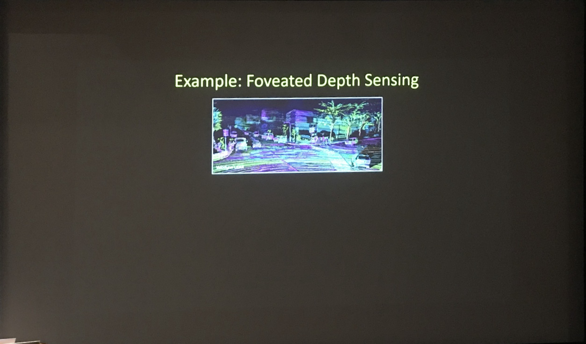
- Foveated camera: capturing some of the information, some of the time regarding diff tasks
- Foveated lidar (static scone with fovea)
- Human's fovea < 1mm, local focus. Other animals have different scanning modes.

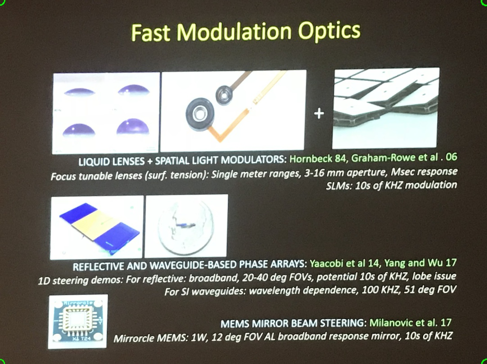

#### Minimal supervision and zero-shot learning
- Zeynep Akata from Max Plank
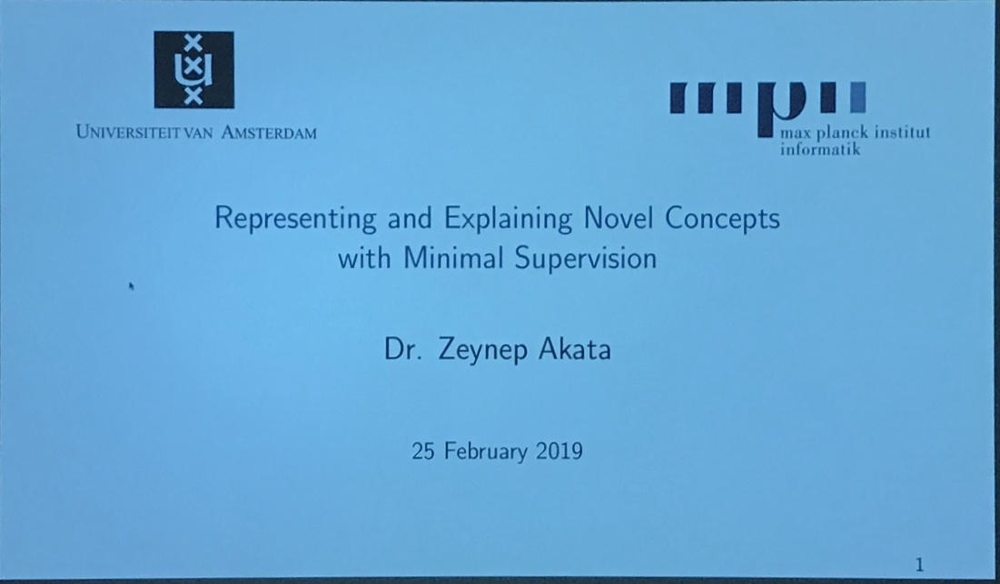
- Long tail distribution in large-scale dataset. Rarely found in nature and hard to name
- attribute as side information (symptoms in medical imaging), multi-class, multi-label issue. (Again, combinatorial!)
- Zero-shot learning
- CUB dataset (caltech uscd birds, 200 cls, 312 attr)
- Instead of generating images to help classifier, generate attributes directly. This boosts zero-shot classifier significantly (CVPR 2018)
- Toward explainable ML: Generating text explanations of the decision
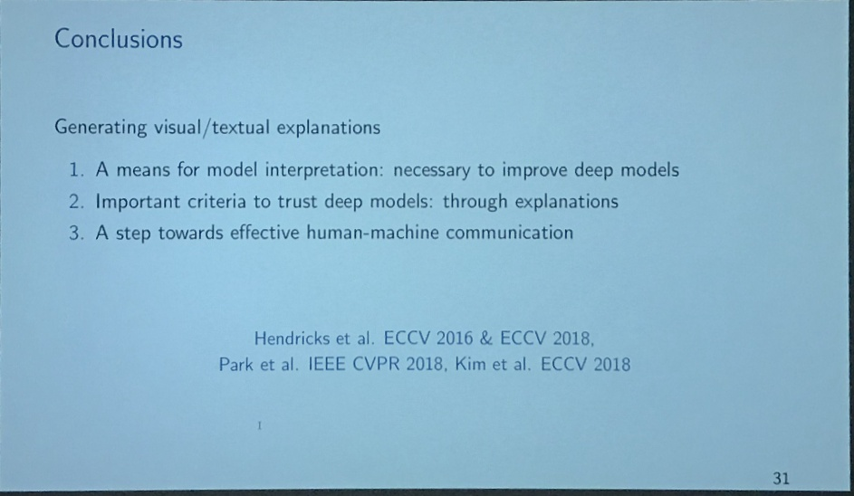

#### Generalization in data-driven stereo matching
- Philippos Mordohai from Stevens I of T
- Patch similarity estimation
- MC-CNN for matching patches (stereo matching) by LeCun's group
- 3DV: international conf on 3D vision
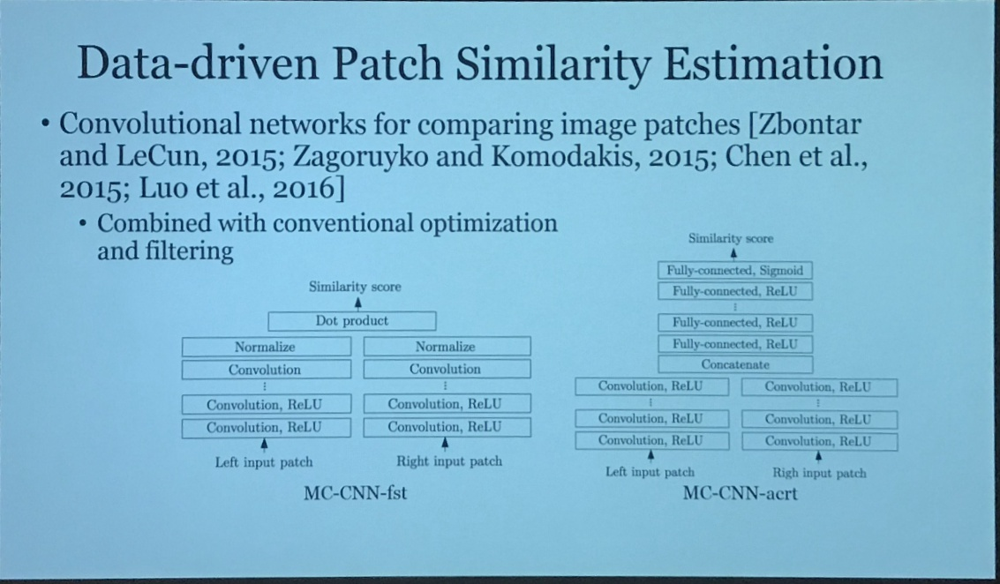

#### Semantic amodal instance-level video object segmentation
- Alex Schwing
- Amodal segmentation: recognizing the full extent of objects
- Synthetic data with GTA-5, with ScriptHook V to control the game
- RGB, depth buffer, stencil buffer --> amodal segmentation
- Amodal 2D/3D pose information
- Multiple arch:
	- Mask Amodal: maskRCNN to predict amodal mask
	- Mask Cascade, predict modal/vidible mask and then amodal mask
	- Mask Joint: predict modal and amodal masks simultaneously
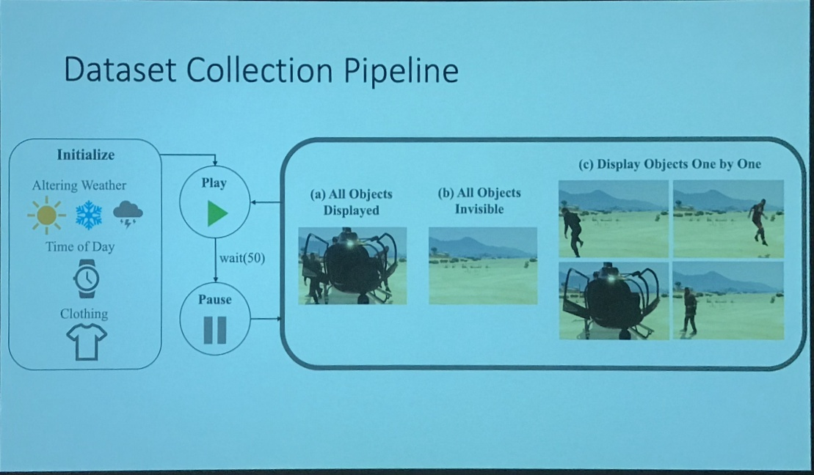
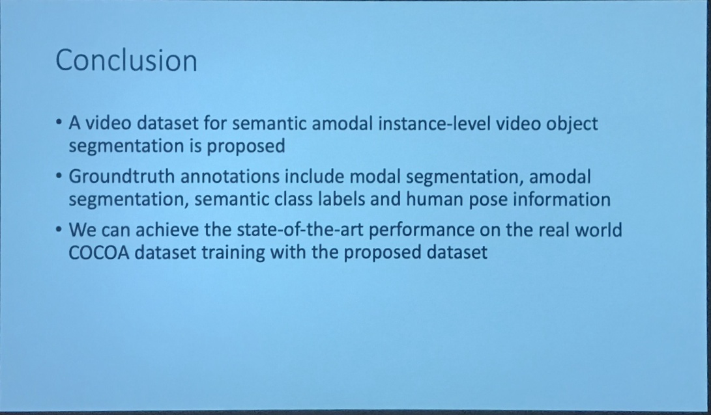

#### Feedback GRUs
- Thomas Serre from Brown Univ.
- Long range interactions in visual perception
- Hyper columns in different regions of the visual field
- From a neural circuit (ODEs) to ML module (RNN) (NeurIPS 2018)
- FFN: flood field neural network
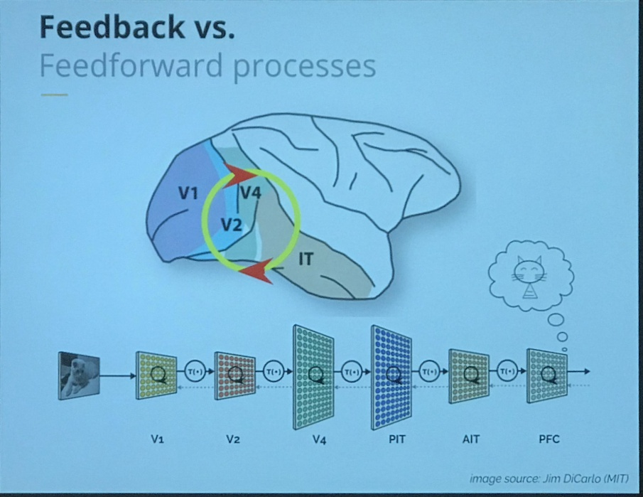
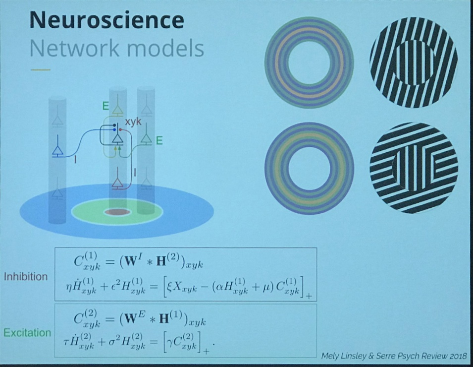

#### Botton up object detection
- Philipp Kraehenbuehl
- **ExtremeNet**
- Top-down object detection: such as FRCNN. Are you scanning the image to see if a bbox contains an object (top-down) or try to construct an object from points (bottom-up)
- Predict four extreme points
- Extreme points: easier to annotate, easier to predict, better masks (Octagon, etc), better than bounding box top-left and bottom-right corners
- Hourglass  Network for predicting keypoints
- Instance segmentation almost for free, approaching R50 mask-rcnn even without training on COCO masks

#### Building Systems which understands Vision and Language (VQA)
- Marcus Rpohrbash from FAIR
- Answer questions from visual understanding or results from OCR module
- Problem: Slight change in question leads to diff answer!
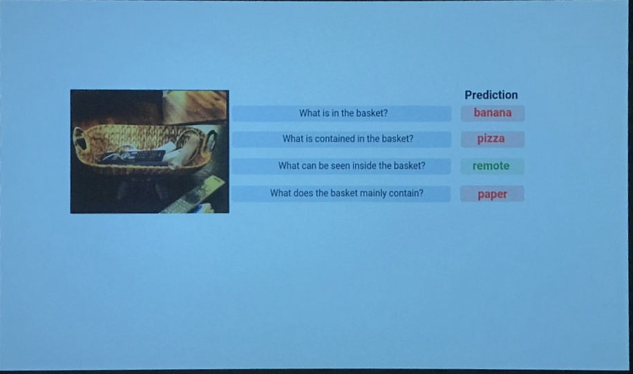
- Cycle consistency for robust VQA (consistency again!)
	- not end-to-end trained
- Failure prediction (how?) performance is also better
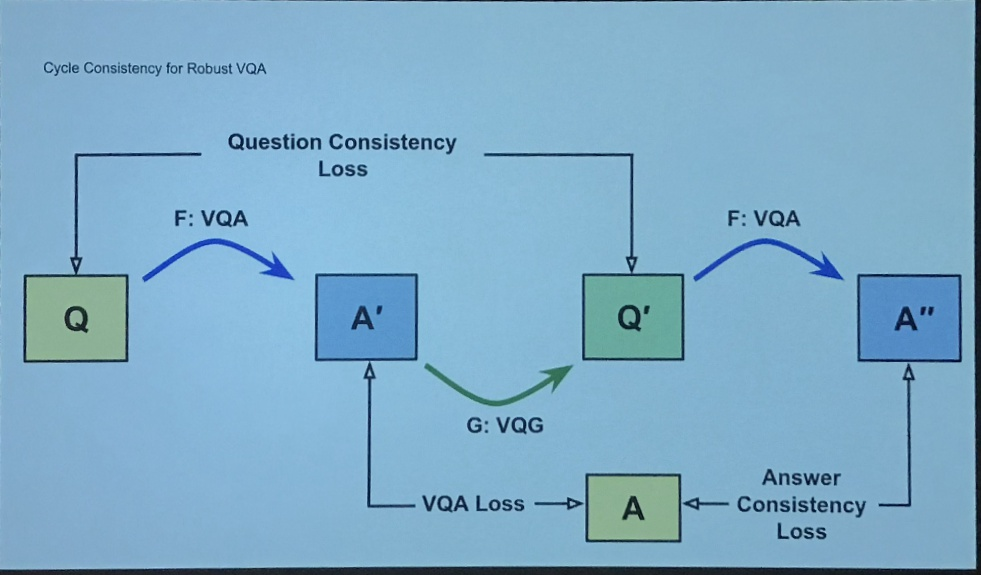

#### Learning 3D deformable model from 2D images
- Xiaoming Liu from Michigan State
- Image formation: 3D shape, lighting, albedo
- Estimate 3D shape and texture from a single 2D image. This is trained in a cycle-consistent fashion. 
	- Predict to reconstruct 2D images with conventional pipeline, then enforce loss.
- Applications: Face alignment, face sticker (on albedo, not on surface)

#### Biomedical computer vision
- Pablo Arbelaez from Universidad de los Andes
- Language based: "get the mask of the second woman on the right"
- Lung nodule detection
	- Nodules < 3 mm 
- ISBI challenge 1st place

#### Evolving space-time neural architecture for videos
- Michael Ryoo from Univ. of Indiana
- I3D (inflated 3 dim) and S3D (2+1 dim)
- Similar to NAS, evolutionary search algorithm, such as adjusting the temporal length of the filter
- 3D conv is not really necessary

#### Competitive collaboration: Joint unsupervised learning
- Deqing Sun
- Training multiple networks with mixture of data. The data is allocated to either network in an unsupervised fashion. The resulting network can achieve good performance on both datasets.
- Note: is this like universal model? Leverage more datasets in unsupervised way
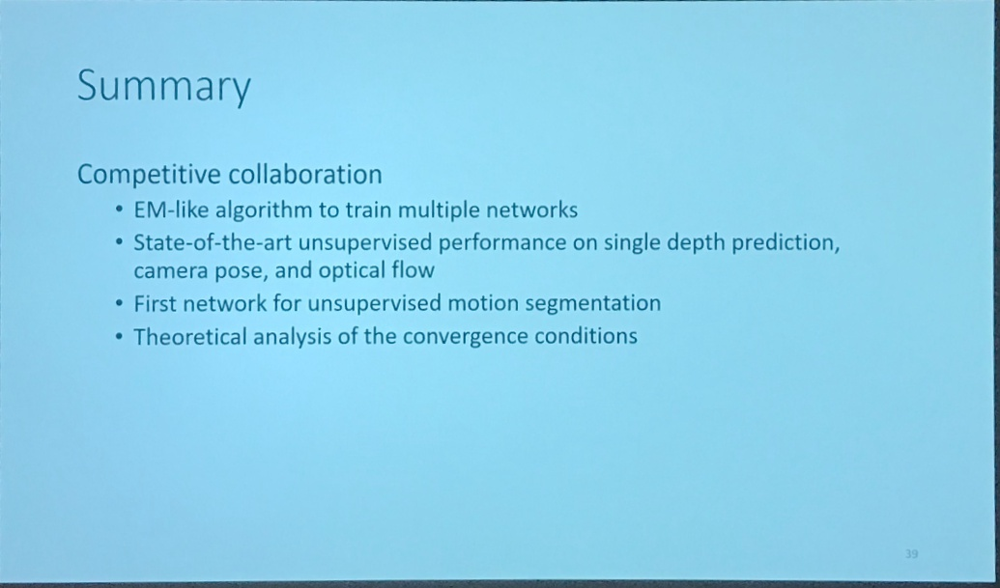

#### Adapting and Generalizing across domains
- Judy Hoffman: FAIR --> Gatech
- Learning with big labeled data
	- Pretrain
	- Simulated data
	- problem: Data are proprietary or private
- Challenges
	- Test data and train data domain shift 
- Representation alignment
- Image to image translation
	- Train on GTA, apply directly, bad results
	- CyCADA: Hoffman ICML 2019
- Challenge2: combining multiple source of data
- NeurIPS 2018: ensure data privacy and train jointly
- Adaptation vs Generalization
- Note
	- Hoffman's work is great! needs to investigate more.
	- Trivia: Semantic segmentation $10 per frame to annotate
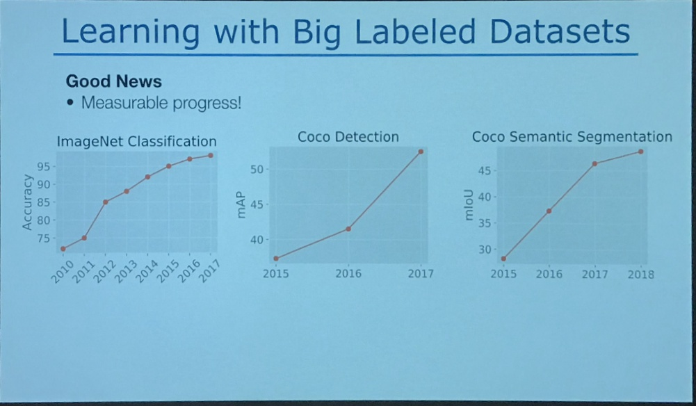
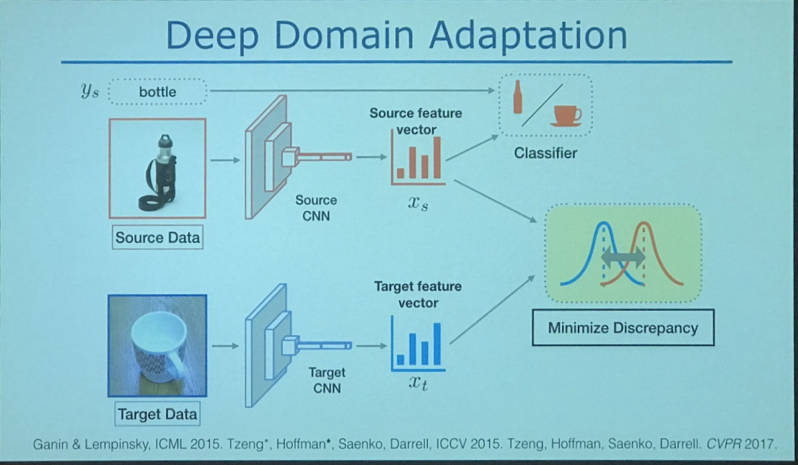

#### Binary image selection (BISON) interpretable evaluation of visual grounding
- Captioning scores (BLUE-4, METEOR, etc) correlate poorly with human evaluation of correctness and detailedness
- Dataset:
	- Find similar image pairs
	- Select distinctive text
	- Verify distinctive text
- Note: FastText for text embedding

#### General and adaptive robust loss function
- Jonthan Barron from Google Research
- Least square sensitive to outliers. L1 is better
- Robust function has multiple shapes
- 3D registration loss (GM)
- Cannot let computer to do the optimization of alpha if L = 0 for inliers.
- "Pixels are the worst case of representations of images".
- Notes: 
	- This is interesting!
	- desmos for live demos
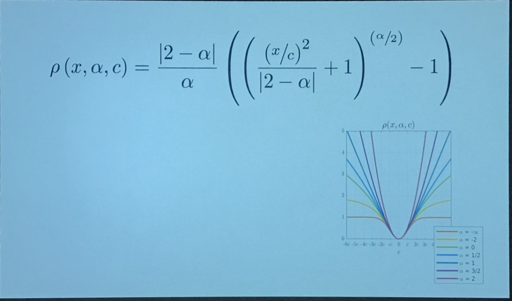
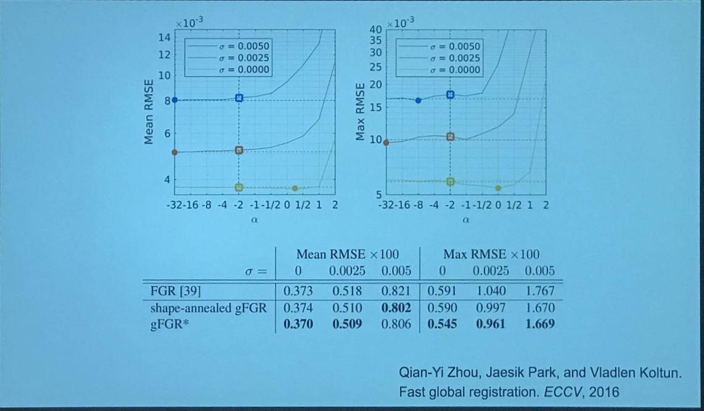
	
#### DeepLesion
- Le Lu from NIH/PingAn
- Goal in medical imaging AI
- Instance level of Similarity
	- Discover type and location automatically (self-annotation)
	- Similarity relationship by triplet loss
	- Retrieve similar lesions from databases
	- Track the same lesion in follow-up studies: prognosis
- Gibbs Sampling

#### Maps
- Qixin Huang
- Monocular reconstruction (space of images --> spaces of 3D models)
- Benefits of joint learning fo neural networks
	- More data
- Cycle consistency and path invariance
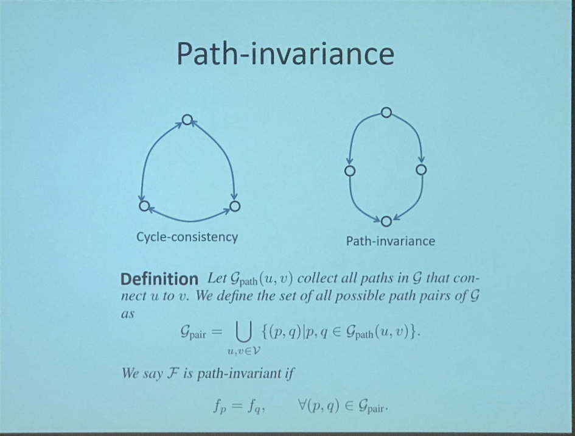

#### FineGAN
- Yong Jae Lee from UC Davis
- Note: "What I cannot create, I do not understand" -- Richard Feynman
- Disentangle various factors of variation: background, shape, apperances
- Capture by a cascade of 3 stages: background, parent (mask), child
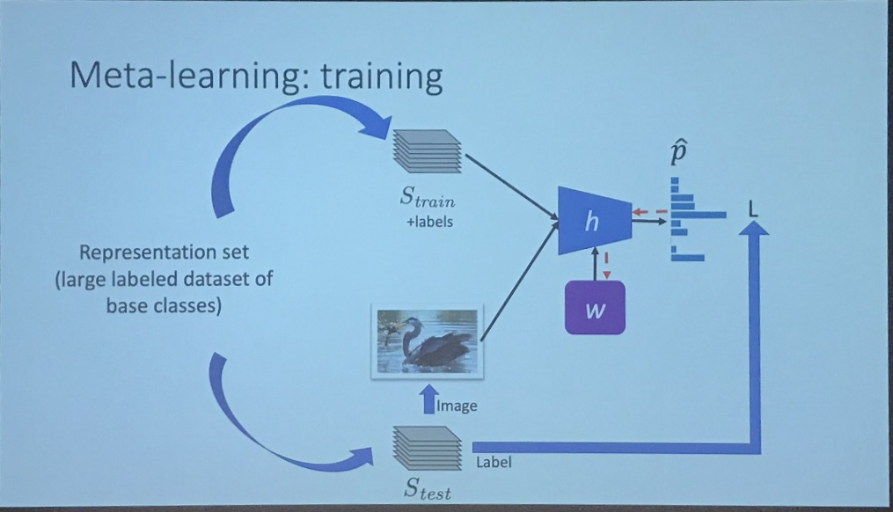
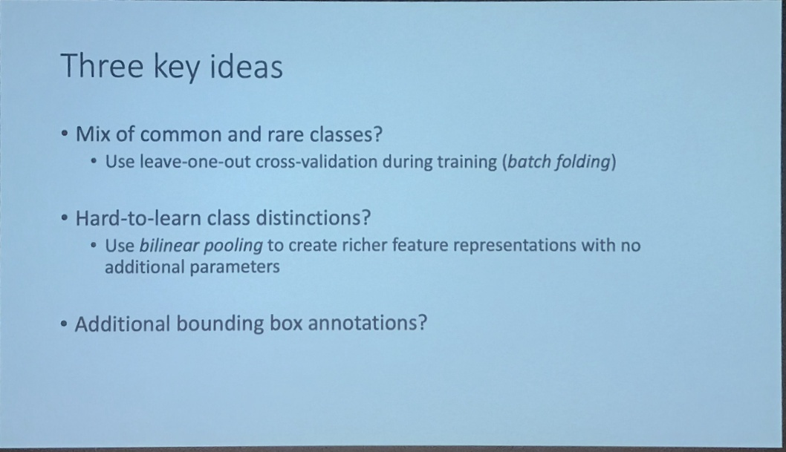

#### Learning from video
- Bryan Russell from Adobe Research
- Bounce and learn: path dynamic planning, predict how object bounce off different surfaces
- Dataset obtained using Stereo camera: high frame rate
- High school physics: Collision normal and coefficient of restitution
- Collision normals changes with deformation and may not be the same with surface normals
- Processed point cloud with PointNet

#### Deep Learning and Perceptual Organization
- Stella Yu at Berkeley
- Softmax does not capture class similarity
- Cram 1.2 m images into 128D feature space. Non-parametric. Each instance is a class. CVPR 2018
- Bottom up cue from images
- Semantic label is Top down cue
- How to combine the two? Neighborhood Component Analysis
- 127 Coarse grain vs 1000 find grain in ImageNet
- Learning with minimal supervision (imagenet has objects in the center)
- This can be extended to semantic segmentation. How? Paper rejected at CVPR2019

#### End-to-End projector photometric compensation
- Haibin Ling from Temple Univ.
- LaSot: single object tracking database
- Projector compensation
	- Not a pix2pix problem, but rather a non-linear problem
- CompenNet to formulate the compensation problem as a deep learning problem
- Note: state your problem clearly before diving into details!

#### Visual learning under realistic data constraints
- Bharath Hariharan from Cornell
- Few shot learning
	- Omniglot dataset leanring, Vinyals Oriol et al in NIPS 2016
- Learning to model the tail, Wang et al, NIPS 2017
- Very tiny amount of bbox can boost classification results a lot