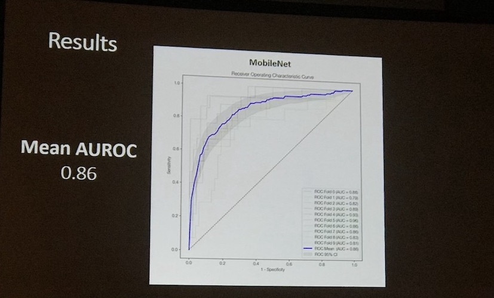
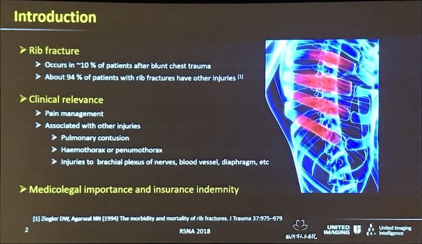
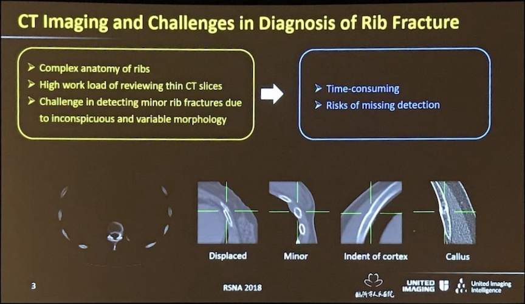
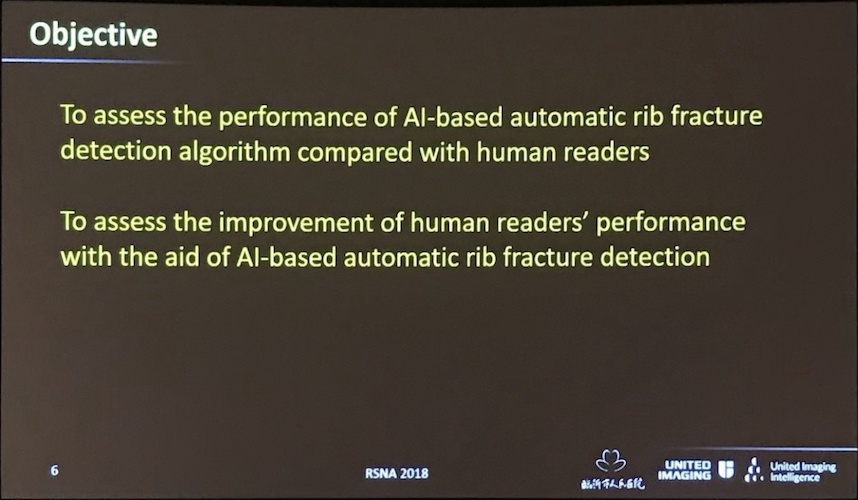
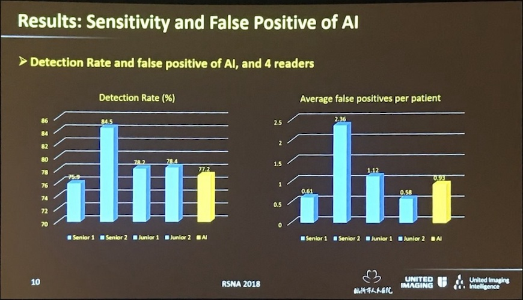
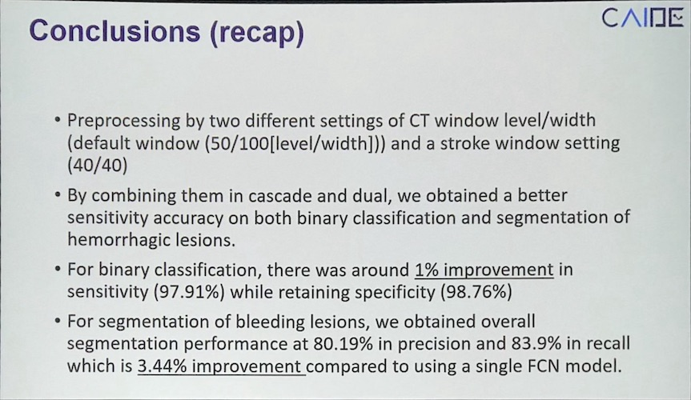
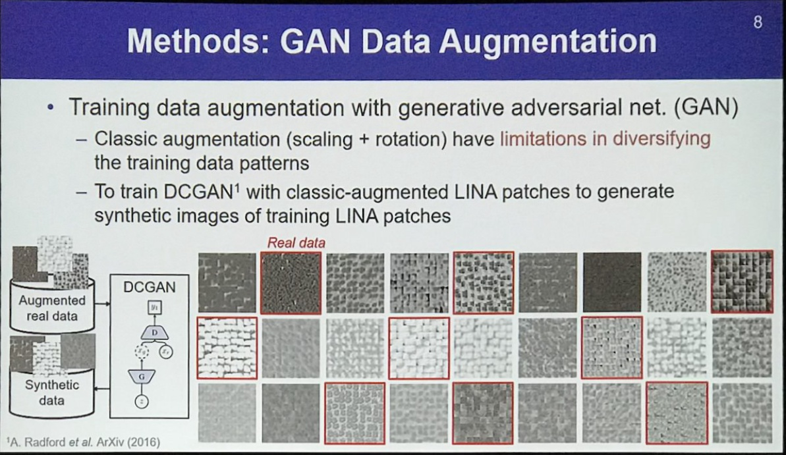
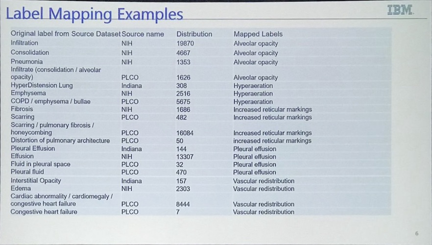

# RSNA 2018 Meeting Notes

## SUNDAY

### SSA12
[Abstract](./assets/abstract_SSA12.pdf)

#### AI keynotes 
- Detection pipeline
	- two stage: faster rcnn
	- one stage: YOLO, SDD, retinaNet(!)
- AI + Doctor workflow

#### Ian Pan (thyroid)
- Predict malignancy of thyroid in US
- 1 transverse + 1 sagittal view for each nodule
- Methodology:
	- Different Arch 
	- Ensemble of models trained on 3 different splits
	- ramdom search for hyperparameter tuning
- Important to do multiple splits for small datasets (CI and smoothing effect)

- github.com/i-pan/thyroid-us

#### *Rib fracture*
- Chenwei Li gave the talk from LinYi Hospital on behalf of Xiaodong Li
- United Imaging
- Architecture: 3D ResUnet, 3 layers
- 100 patients, 726 factures, thin slice <1 mm CT
- GT by consensus

#### Brain stroke detection (CAIDE from Korea)
- Ischemic vs ICH
- ICH has many types

- Narrow window width (40/40 for stroke window)

- cascaded CNN for cls: both saying no, then no (this is a way to leverage different characteristics of ROC)

- Different classes for segmentation

- Narrowed window increases detection results (!need to try)

#### Liver focal liver lesion (FLL)
- The author is from [KAIST](https://hansanglee.wordpress.com/)
- Classification of liver nodules
- Generation of **LINA** patches (lesion Information Augmentation) (this is quite interesting! seems like random need more investigation)

- GAN generated samples based on LINA patches

- ROC, recall ~0.8-0.85 at FP of 0.1

#### Unirary stone detection
- GrayNet: address generality issue of DL models
- Best solution: large-scale, well-annotated data
- Workaround: 
	- Transfer learning
	- **Learning anatomy before pathology**
	- ImageNet --> GrayNet --> MI DL App
- Weights will soon be published

#### Combining Chest X-ray Datasets (IBM Almaden Research)
- PLCO, NIH, Indiana collection
- Normalizing annotation vocabulary (label) from diff datasets (mapping table listed below)

#### Automatic cls and reporting
- Extract 14-bit label with LSTM from raw text report
- For the release of reports, ask Ronald Summers at NIH

#### Detection of Fracture of distal radius in X-ray
- 1900 xray images, 1350 negative + 450 positive
- Augmentation rotation: up to 10 degrees
- Used DL GUI to 