# RSNA 2018 Meeting Notes
- [RSNA 2018 Meeting Notes](#rsna-2018-meeting-notes)
  * [SUNDAY](#sunday)
    + [SSA12](#ssa12)
      - [AI keynotes](#ai-keynotes)
      - [Ian Pan (thyroid)](#ian-pan--thyroid-)
      - [*Rib fracture*](#-rib-fracture-)
      - [Brain stroke detection (CAIDE from Korea)](#brain-stroke-detection--caide-from-korea-)
      - [Liver focal liver lesion (FLL)](#liver-focal-liver-lesion--fll-)
      - [Unirary stone detection](#unirary-stone-detection)
      - [Combining Chest X-ray Datasets (IBM Almaden Research)](#combining-chest-x-ray-datasets--ibm-almaden-research-)
      - [Automatic cls and reporting](#automatic-cls-and-reporting)
      - [Detection of Fracture of distal radius in X-ray](#detection-of-fracture-of-distal-radius-in-x-ray)
  * [MONDAY](#monday)
    + [SSC09](#ssc09)
      - [Keynotes](#keynotes)
      - [Nodule retrieval and matching](#nodule-retrieval-and-matching)
      - [Bone suppression](#bone-suppression)
      - [Lung cancer survival prediction](#lung-cancer-survival-prediction)
      - [Predict ICH from Sinogram](#predict-ich-from-sinogram)
      - [Accelerating annotation with eye trackers](#accelerating-annotation-with-eye-trackers)
      - [Automatically recognition of mislabels](#automatically-recognition-of-mislabels)
      - [Performance with Chest Xray](#performance-with-chest-xray)
      - [Mobile Chest Xray system](#mobile-chest-xray-system)
    + [RSNA challenge recap](#rsna-challenge-recap)
      - [1st place](#1st-place)
      - [3rd](#3rd)
      - [4th](#4th)
      - [5th](#5th)
      - [6th](#6th)
      - [8th](#8th)
    + [SSE14](#sse14)
      - [Classification of lateral and frontal Xray images](#classification-of-lateral-and-frontal-xray-images)
      - [segmentation of kidney](#segmentation-of-kidney)
      - [Liver segmentation with active learning](#liver-segmentation-with-active-learning)
  * [TUESDAY](#tuesday)
      - [CT spine fracture detection](#ct-spine-fracture-detection)
      - [Using GAN to generate chest DR image](#using-gan-to-generate-chest-dr-image)
      - [GAN generate ICH slices](#gan-generate-ich-slices)
      - [ICH segmentation](#ich-segmentation)
      - [Brain tumor segmentation](#brain-tumor-segmentation)
      - [Femoral Neck Fracture Detection](#femoral-neck-fracture-detection)
      - [Classification of DR with meta data](#classification-of-dr-with-meta-data)
      - [@ideas: Gan with attention in differentiator](#-ideas--gan-with-attention-in-differentiator)
  * [WEDNESDAY](#wednesday)
    + [SSK02](#ssk02)
      - [Breast density](#breast-density)
      - [cancer detection for Mammo screening](#cancer-detection-for-mammo-screening)
      - [Mammo detection reader study](#mammo-detection-reader-study)
      - [GAN to insert and remove lesion from mammo](#gan-to-insert-and-remove-lesion-from-mammo)
      - [million mammo](#million-mammo)
      - [Mammo detection](#mammo-detection)
      - [CAD for tomo](#cad-for-tomo)
      - [Tomo DBT vs mammo](#tomo-dbt--vs-mammo)
      - [breast density estimation](#breast-density-estimation)

Disclaimer: These are my personal notes on deep learning related talks when I attended RSNA 2018. If you are the author and find any mentioning of your work undesirable, please let me know by filing an issue in the repo or contact me at `pliu_AT_12sigma.ai`.

## SUNDAY

### SSA12
[Abstract](./assets/sun/abstract_SSA12.pdf)

#### AI keynotes 
- Detection pipeline
	- two stage: faster rcnn
	- one stage: YOLO, SDD, retinaNet(!)
- AI + Doctor workflow

#### Ian Pan (thyroid)
- Predict malignancy of thyroid in US
- 1 transverse + 1 sagittal view for each nodule
- Methodology:
	- Different Arch 
	- Ensemble of models trained on 3 different splits
	- ramdom search for hyperparameter tuning
- Important to do multiple splits for small datasets (CI and smoothing effect)

- github.com/i-pan/thyroid-us

#### *Rib fracture*
- Chenwei Li gave the talk from LinYi Hospital on behalf of Xiaodong Li
- United Imaging
- Architecture: 3D ResUnet, 3 layers
- 100 patients, 726 factures, thin slice <1 mm CT
- GT by consensus

#### Brain stroke detection (CAIDE from Korea)
- Ischemic vs ICH
- ICH has many types

- Narrow window width (40/40 for stroke window)

- cascaded CNN for cls: both saying no, then no (this is a way to leverage different characteristics of ROC)

- Different classes for segmentation

- Narrowed window increases detection results (!need to try)

#### Liver focal liver lesion (FLL)
- The author is from [KAIST](https://hansanglee.wordpress.com/)
- Classification of liver nodules
- Generation of **LINA** patches (lesion Information Augmentation) (this is quite interesting! seems like random need more investigation)

- GAN generated samples based on LINA patches

- ROC, recall ~0.8-0.85 at FP of 0.1

#### Unirary stone detection
- GrayNet: address generality issue of DL models
- Best solution: large-scale, well-annotated data
- Workaround: 
	- Transfer learning
	- **Learning anatomy before pathology**
	- ImageNet --> GrayNet --> MI DL App
- Weights will soon be published

#### Combining Chest X-ray Datasets (IBM Almaden Research)
- PLCO, NIH, Indiana collection
- Normalizing annotation vocabulary (label) from diff datasets (mapping table listed below)

#### Automatic cls and reporting
- Extract 14-bit label with LSTM from raw text report
- For the release of reports, ask Ronald Summers at NIH

#### Detection of Fracture of distal radius in X-ray
- 1900 xray images, 1350 negative + 450 positive
- Augmentation rotation: up to 10 degrees
- Used DL GUI to train model

## MONDAY

### SSC09
[Abstract](./assets/mon/abstract_SSC09.pdf)

#### Keynotes
- Ronald Summers from NIH (ChestXray14 initiator)

- Major directions: Detection, Segmentation, Mapping, Image Synthesis
- Broad scope
	- RECIST labeling (keypoint regression of major/minor axes): used for treatment
- Datasets
	- [Lymph Node CT Datasets](https://wiki.cancerimagingarchive.net/display/Public/CT+Lymph+Nodes#663e5b256e85496ba3eaa26deb1050c3) (176 scans with segmentation masks) 
	- [Pancreas CT Datasets](https://wiki.cancerimagingarchive.net/display/Public/Pancreas-CT): 82 scans
	- ChestXray14
	- Deep Lesion
- Ionizing radiation (CT, Mammo, X-ray) vs Non-ionizing (US, MRI)
	
	
#### Nodule retrieval and matching
- Ke Yan from NIH
- DeepLesion dataset
	- "Bookmasks" marked by radiologists to highlight abnormal lesions in their daily work
- Weakly labels
	- Annotaed 2k, predicted pseudo label for others (?)
- Triplet loss (!need to look closer)

- Intra patient lesion matching and inter-patient lesion retrieval 

#### Bone suppression
- Generate bone-only and tissue-only images from one single DR image

- Conventional methods: dual energy imaging

- GT: Dual Energy image 461 cases of DE DR

- Architecture: predict coarse image first, then use smaller receptive field to focus on details

- **Predict bone image, then subtract it to keep fine details**

- SSIM > 0.98 for tissue only images

- Foreign objects not excluded. Only produce bone-only image
- Did not use ResNet, see paper DDSR

#### Lung cancer survival prediction
- Yiwen Xu from Dana-Farber
- Multiple images in a sequence. This is like time series: video action classification
- Input: seed point, bbox in CT, 1, 3, 6 month after therapy
- 2.5 D: not necessarily the immediate scans. Use **larger spacings** (!)
- More follow-ups leads to better prediction

- We cannot just concat images from different time points into channels and predict. Then the network will learn that if a timepoint is missing, the patient is dead. Now every time point is processed by a CNN first, then use a RNN to aggregate the results. 

#### Predict ICH from Sinogram

- 720 cases (~6k slices)
- Reverse generation of sinogram based on CT images (lossy conversion as Radon is not the inverse of CT recon)
- two windows: full window and ICH window (!need to try)
	- ICH: W/L = 50/100
- ICH window > full window (more information is not necessarily better. Need more information)

#### Accelerating annotation with eye trackers
- Paul Murphy@UCSD Radiology
- Tobii 4c device, cost about $150 as of 2018/11/26

- annotation error ~1cm
- Precision drop toward the edge

#### Automatically recognition of mislabels
- Train model first
- Manually flip the label
- Rank mislabeled data by ranking the scores
- Auto-fix the label (why not flag suspicious results for doctors to verify?)
- Loss function: cross entropy + influence function
- Influence function: [ICML2017 best paper](https://arxiv.org/pdf/1703.04730.pdf) **(needs to read!)**

#### Performance with Chest Xray
- Qure.ai from India
- opacity (focal or diffuse)
- any abnormality
- Tested classifier on follow-up chest xrays
- Detect early symptoms in chest xray (that are missed by doctors on DR but later identified in CT)

#### Mobile Chest Xray system
- RadiSen company
- visualization with GradCAM or GradCAM++
- Used GAN to generate image for domain adaptation

### RSNA challenge recap
- Last year bone age challenge, this year pneumonia
- Ron Summers, head of AI lab at NIH
- Challenges in de-identifying the patients: manual inspection twice to remove identifiers in the images

#### 1st place
- Classifier + detector
- More than 10 models in the ensemble!
- [source code](https://github.com/i-pan/kaggle-rsna18)

#### 3rd
- Philips Cheng from USC
- simple ensemble of 2 retinaNets (single stage), very clean
- shrink bbox by 17% increases leaderboard score
- [source code](https://github.com/pmcheng/rsna-pneumonia)

#### 4th
- 16 bit + layer6
- They did not know the test set was annotated by 3 truthers, but they seem to have analyzed the statistics after stage 1
- intersection of 3 detectors (yolo, faster, mask rcnn)
- filtered by classifier

#### 5th
- Imsight (视见科技)
- one month intern's work

- majority voting of multiple detectors

- filtered by classifier

#### 6th 
- DeepRadiology

- [CoupleNet](https://arxiv.org/pdf/1708.02863.pdf), similar to R-FCN and R-CNN, but uses local and global contexts

- Grouped bboxes from ensemble of models based on IoU

#### 8th
- Filipe Kitamura (北村？) From Brazil
- RetinaNet with ResNet backbone
- Modified anchor box ratio

- Shrank bbox size by 16%

### SSE14
#### Classification of lateral and frontal Xray images
- Misclassification scores are all over the place, not robust

#### segmentation of kidney
- Used scouting to zoom into the VOI

- Implementation of dice score improved performance quite a lot
- Impressive UNet activation visualization

#### Liver segmentation with active learning
- active learning
- Use open dataset, evaluate on institutional data. Identify worse performing cases, then relabel.

## TUESDAY
Kheiron (喀戎), a UK-based company, has an impressive demo of breast generated by GAN. **They have a publication on [ArXiv](https://arxiv.org/pdf/1807.03401.pdf).**

#### CT spine fracture detection
- SSG08-03
- Karen Cheng from UCSD, Peter Chang, director of medical AI lab at UCI
- Sagittal bine reconstruction
- Two stages: 3d mask rcnn for detection, followed by 3d resnet for classification
- 3d mask rcnn: actually hybrid 2.5 d. Feedi multiple layers, instead of multiple channels, then perform 3d convolution as well.
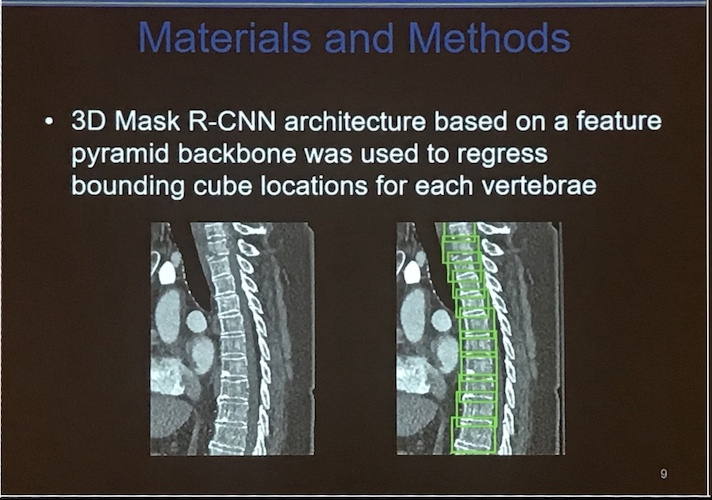
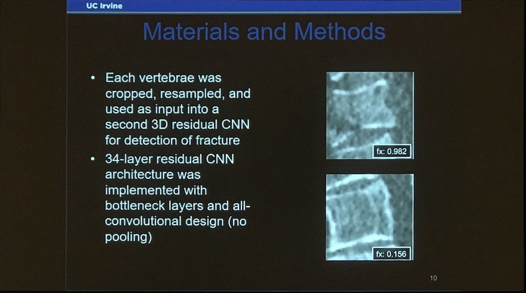
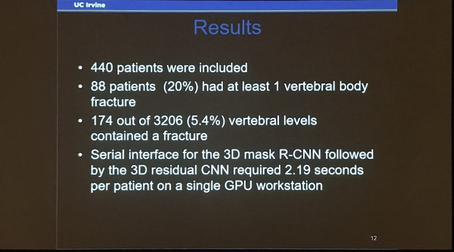

#### Using GAN to generate chest DR image 
- SSG06-07
- [Sliced Wasserstein GAN](https://arxiv.org/pdf/1803.11188.pdf)
- NIH dataset, downsized to 512 x 512
- Demo: https://courses.engr.illinois.edu/ece544na/fa2018/check/
- Radiologists favor GAN 30% of the time
- Checkerboard artifact sometimes visible. Radio-opaque legends not sharp.
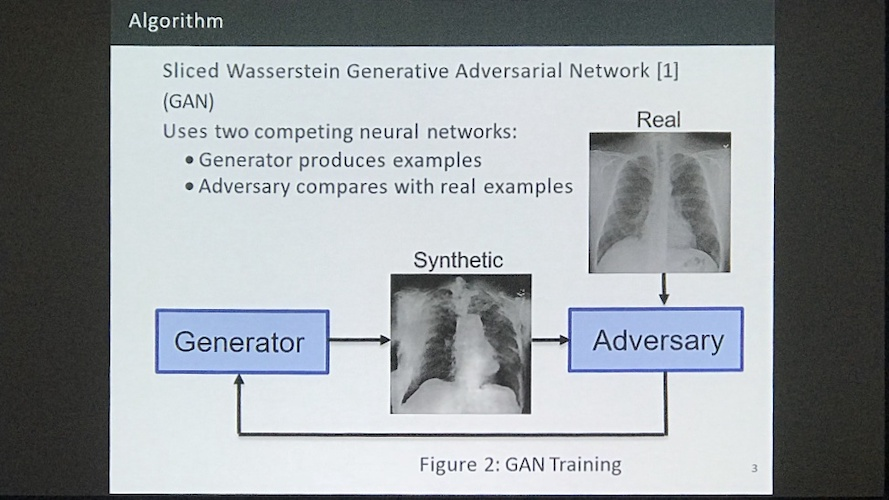

#### GAN generate ICH slices 
- SSG06-08
- CAIDE
- Generate 2d ICH slices. Feed image label pair. No need to label again.
- conditional GAN (cGAN) similar to [this lung nodule synthesis paper](https://arxiv.org/pdf/1806.04051.pdf)
- cGAN: In an unconditioned generative model, there is no control on modes of the data being generated. In the Conditional GAN (cGAN), the generator learns to generate a fake sample with a specific condition or characteristics (such as a label associated with an image or more detailed tag) rather than a generic sample from unknown noise distribution. A good summary can be found [here](http://www1.idc.ac.il/toky/seminarIP-18/Presentations/10b_raaz.pdf).

#### ICH segmentation
- SSJ18-03
- 95 cases with ICH, one scan for one patient was included
- 60/5/30 for train/valid/test
- two thresholds:
	- High threshold: high specificity
	- Low threshold: high sensitivity
	- different post processing technique
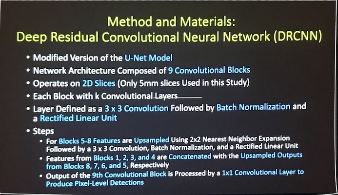
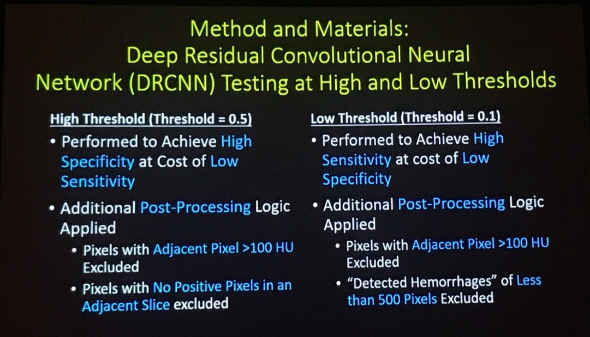
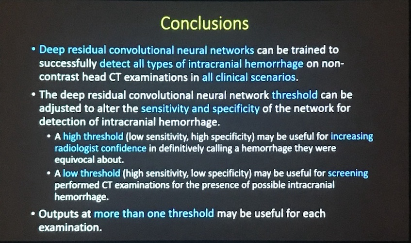

#### Brain tumor segmentation 
- SSJ18-06
- Train on coarse tumor first, then finetune with added small tumor. Similar to curriculum learning
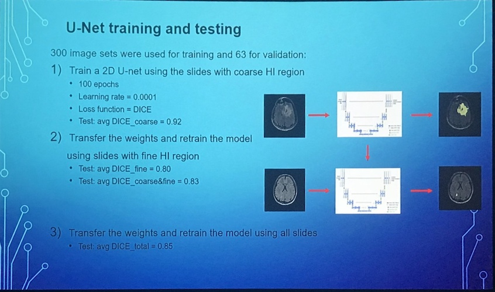

#### Femoral Neck Fracture Detection
- Generation of training data with DRR
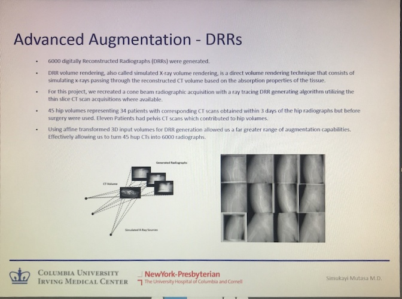 
- The GAN generated images look rather distorted. Does it even help with classification task?
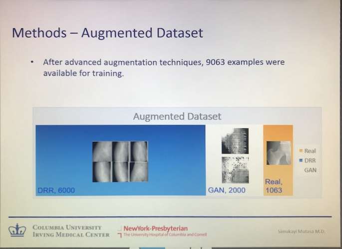 

#### Classification of DR with meta data
- feeding meta data to model for DR classification. 
	- Concat category data to fc layer
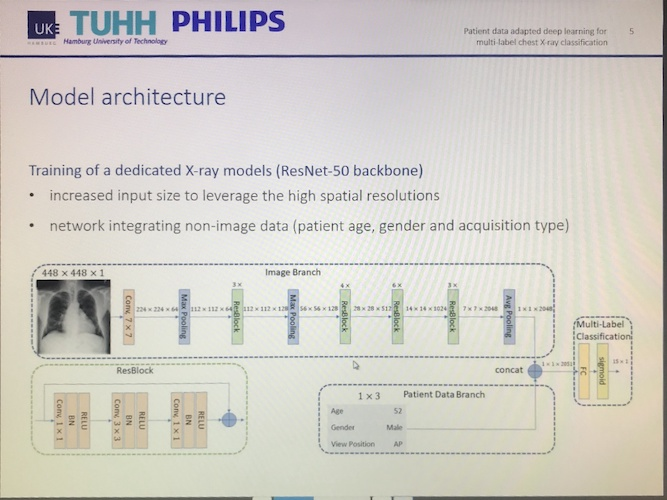
- The idea is worth trying, but results are not promising
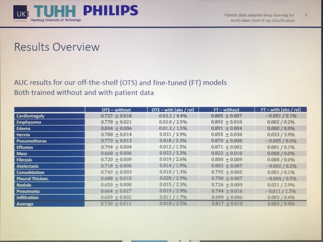

#### @ideas: Gan with attention in differentiator
- Can we identify what looks weird in the generated image and use the more location-specific loss to guide the generator?

## WEDNESDAY
### SSK02
#### Breast density
- studies published recently

- poor intra-reader and inter-reader correlation in the qualitative assessment in human reading
- AI performs better in the hetero and scattered cases

#### cancer detection for Mammo screening
- CAD does not really help prior to DL. How about now?

- commercial product named transpara
- hybrid case: 1 FP per 50 images, semi-automatic

- Better ROC

- No really increase of reading time overall; reduces time for easy cases, but increases time for hard cases

#### Mammo detection reader study
- Jung Yin Huh, medical director for Lunit
- Beautiful GUI!

- 2nd reader study: 80k patients (we need more data!)
- Comments from the audience: Use of inexperienced reader will accentuate the importance of the tool

#### GAN to insert and remove lesion from mammo
- Dr. Anton Becker; anton.becker@usz.ch
- paper on [ArXiv](https://arxiv.org/pdf/1811.07767.pdf)
- zero-sum game: saddle point optimization problem
- cycle GAN, image to image translation

#### million mammo
- Hari Trevidi vs Peter Chang
- 7-8 per 1000 cancer rate
- 50%+ get at least one false recall in 10 years
- what is the relevant clinical questions we want to answer?

- classify definitively negative cases (so 0 is positive, only 1 and 2 are 
- Mask RCNN network. Downsize images of mammogram not recommended 
- specificity 99.7%. only 0.3% of patient will be missed.

- How did they arrive at this number?

#### Mammo detection
- Dr. Watanabe
- CureMetrix, evaluation of product cmAssist AI-CAD

- neuScore returned by the product

#### CAD for tomo
- Lunit
- Background

- Purpose

- Methods

- Architecture: transfer learning from tomo

- Result:

- Sample comparison with DBT only vs Mammo+DBT

- sensitivity of calc is about the same between Synthetic mammo is about the same as tomo
- trained on 2d thin slices of tomo and deployed on 3d slice by slice

#### Tomo(DBT) vs mammo
- DeepHealth
- Background
- Tomo has way passed the hype

- 3D is similar to action recognition
- Methods:Published at MICCAI-2017 on [ArXiv](https://arxiv.org/pdf/1707.06978.pdf)

- Trend: RSNA is better for publication of reader studies

#### breast density estimation
- BR258-SD-WEA5
- Constance D. Lehman, MD,PhD from MGH and Havard
- DL model and the consensus has the highest agreement
